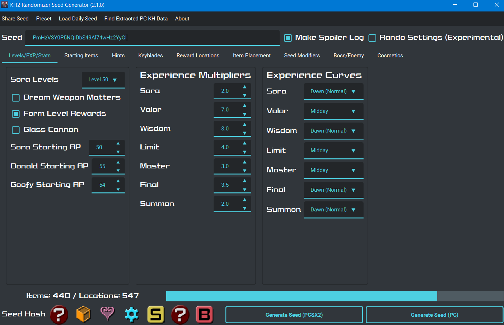

# KH2Randomizer

[Website](https://tommadness.github.io/KH2Randomizer/)



## Running on Linux

The seed generator runs natively on Linux, either from source or as an AppImage.

### From source

Requires Python 3.12 or newer.

```sh
python -m venv .venv
.venv/bin/pip install -r requirements.txt
.venv/bin/python localUI.py
```

Runtime notes:

- Copying seed strings to the clipboard needs a clipboard utility: `wl-clipboard`
  on Wayland or `xclip`/`xsel` on X11.
- Some distributions need Qt's xcb runtime libraries for PySide6 (for example,
  `libxcb-cursor0` on Debian/Ubuntu).
- Cosmetics features that use the OpenKH tools (keyblade randomization, texture
  recolors) run the OpenKH Windows executables through [Wine](https://www.winehq.org/),
  so `wine` must be installed for those features. Everything else works without it.
- `extracted_data.zip` (bundled with releases) is needed in the repo root for the
  first-launch data extraction, the same as when building the Windows executable.

### AppImage

Download `KH2.Randomizer-x86_64.AppImage` from a release (when available), mark it
executable (`chmod +x`), and run it. The in-app updater downloads new AppImage
releases and replaces itself in place. `--updater` opens the updater directly.

To build the AppImage yourself: `packaging/linux/build_appimage.sh` (see the
comments at the top of the script for prerequisites).

## Acknowledgements

Icons and font by Televo

Special thanks to Sonicshadowsilver2 for the creation of the Garden of Assemblage mod, 1234567890num for helping bring
it to PC, and Bizkit047, Valaxor, and Desa3579 for the original Randomizer

Special thanks to Xeeynamo and the OpenKH team for their reverse engineering effort and the OpenKH Mods Manager, both of
which makes this all possible.
