# Hint Systems

The randomizer community has come up with several hint systems.

* [JSmartee](#jsmartee)
    * [Hint logic](#hint-logic)
* [Shananas](#shananas)
* [Points](#points)
* [Boss](#boss)
* [Path Hints](#path-hints)
    * [Original Locations Cheatsheet](#original-locations-cheatsheet)
* [Spoiler Hints](#spoiler-hints)

## How do I use hints?

When choosing options for generating a seed, choose which hint system to use on the Hints tab. Once generated, your seed
zip file can be loaded into the [Item Tracker](https://github.com/Dee-Ayy/KH2Tracker) either by dragging the zip file
onto the tracker window, or by choosing `Options > Hint Mode > Load KH2Randomizer Zip Seed` and browsing to the seed zip
file.

## What is an Important Check?

The common hint systems typically designate a certain number of items in the game as _Important Checks_. The number can
change depending on the hint system and settings being used, but typically the Important Checks are these:

* Magic Elements
* Drive Forms
* Once More
* Second Chance
* Torn Pages
* Summon Charms
* Proofs

Additionally:

* If using a hint system where Secret Ansem Reports reveal information, the 13 reports themselves are typically
  considered Important Checks
* If World Key Items are in the randomized item pool, they are typically considered Important Checks
* If Promise Charm is in the randomized item pool, it is typically considered an Important Check
* Other items such as Olympus Stone, Unknown Disk, and Hades Cup Trophy are considered Important Checks if
  the `Add Aux. Unlocks as hintable` setting is enabled for the seed

## JSmartee

Once your seed is loaded into the tracker, each location will start with a question mark next to it.

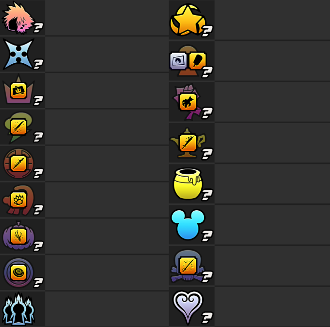

As you find Secret Ansem Reports in the game, each report will tell you how many Important Checks are in a specific
location, and a number will replace the question mark in that location.

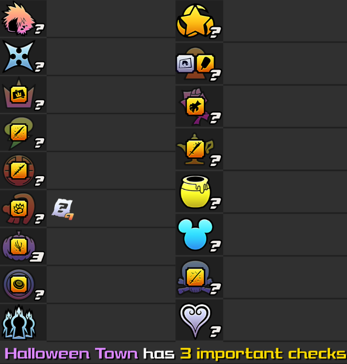

### Hint Logic

Hint logic dictates which locations must be hinted based on where proofs are located. The hint logic is
detailed [here](https://jsmartee.github.io/kh2fm-hints-demo/info.html#logic).

#### What are "hinted hints"? Why do they matter?

_(Taken from the hint logic page linked above, but also included here for additional emphasis)_

> Reports pointing to proofs will be hinted. As an example:
>
> There's a proof in Port Royal. Report 4 points to Port Royal. Report 4 is in Halloween Town. Halloween Town must be
> hinted by another report. If the priority items above (proofs, forms, pages, and magic) are already taking up all 13
> hints, they will be prioritized over these reports. Note: If the reports are on drive forms or in 100 Acre Wood, there
> is no logic to hint forms or pages as of now.

A "hinted hint" is represented in the tracker by the location's number turning blue.

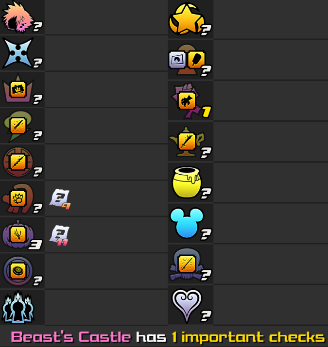

In the screenshot above, Secret Ansem Report 6 (found in Olympus Coliseum) hints Pride Lands. Pride Lands gets a yellow
number because Olympus Coliseum has not been hinted (yet). Secret Ansem Report 13 hints The World That Never Was.
Because there is already a hint pointing to Pride Lands (where Report 13 is located), Report 13 becomes a "hinted hint"
which turns the number for The World That Never Was blue.

Based on this information, it could be inferred that The World That Never Was _may_ have a slightly higher chance of
having a proof than Pride Lands would, since its hint is hinted and its number is blue. _HOWEVER_, being a blue location
does not guarantee a proof. Only once all 13 Secret Ansem Reports are found is it guaranteed that a proof will be in a
location with a blue number.

A general rule of thumb is to not get too caught up in blue numbers early in a seed unless using them as a tiebreaker in
an otherwise 50/50 decision of where to go next. As you get closer to having all 13 Secret Ansem Reports, the more
likely it becomes that a location with a blue number has a proof.

## Shananas

Once your seed is loaded into the tracker, each location will start with a zero indicating you have not obtained any
Important Checks from any of the locations. Any location with a blue zero means there are no Important Checks there.

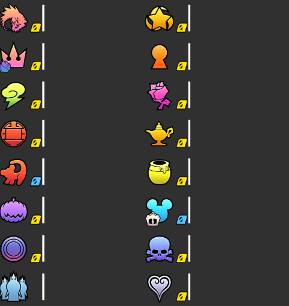

As you find Important Checks in the game, the numbers for each location will track the number of Important Checks found
there. Once the number for a location turns blue, all Important Checks there have been found.

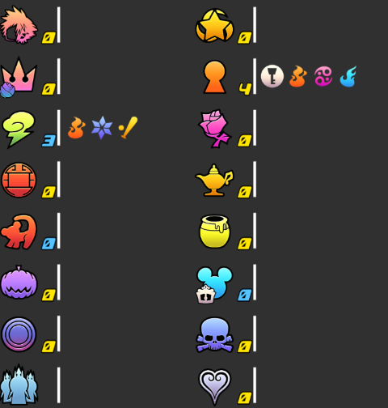

In the screenshot above, 3 Important Checks were found in Olympus Coliseum and the number is now blue, meaning no more
Important Checks are located there (though there still may be useful items/tools there). Additionally, 4 Important
Checks were found in Twilight Town, and since the number is still yellow, Twilight Town must contain at least one more
Important Check.

## Points

Each Important Check is given a category, and each category is given a value for each item in it. Some common point
values for each category are as follows, but the point values can be customized when generating a seed.

| Important Checks            | Generator Default | Spring 2022 League |
|-----------------------------|-------------------|--------------------|
| Proofs and Promise Charm    | 12                | 5                  |
| Drive Forms                 | 10                | 9                  |
| Magic Elements              | 8                 | 7                  |
| Summon Charms               | 6                 | 5                  |
| Second Chance and Once More | 4                 | 5                  |
| Torn Pages                  | 2                 | 5                  |
| Ansem Reports               | 2                 | 3                  |
| World Key Items             | 2                 | 2*                 |

_(*The Spring 2022 league happened before World Key Items were introduced into the generator.)_

Once your seed is loaded into the tracker, each location is given a Score based on how many of each of these it
contains. You are able to see the Score for each location right from the start.

* Ex. (using the generator default point values) If Agrabah has a Score of 12 that may mean it has a Proof, a Drive Form
  and a Torn Page (or it could have any other combination of Important Checks whose point values add up to 12)
* Any location with a blue zero has no Important Checks (though there still may be useful items/tools there)

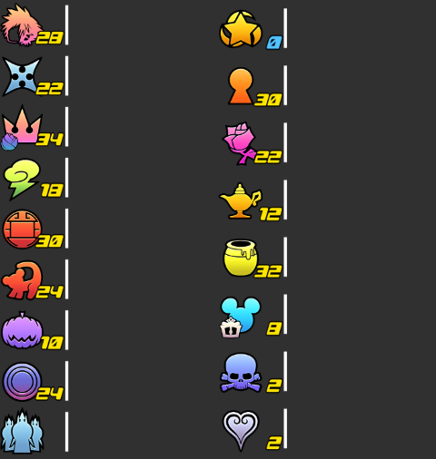

As you find Important Checks in the game, the numbers for each location will decrease by the appropriate point values
until eventually reaching zero, at which time the number turns blue indicating no more Important Checks are there.

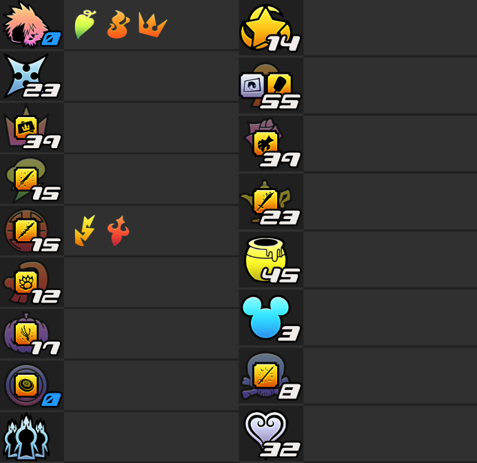

In the screenshot above, 3 Important Checks were found in Land of Dragons but there are still Important Checks there
with a combined value of 10 points. Additionally, a Magnet Element was found in Disney Castle, and since its number is
now a blue zero, no more Important Checks are located there.

## Boss

These hints are primarily used for Boss Enemy randomizer modes such as (but not limited to) 1 Hour Challenge and Boss Enemy Bingo.
These hints display a boss replacement in the current seed. 

For example, consider getting Report 3 in Halloween Town as shown in the image below.

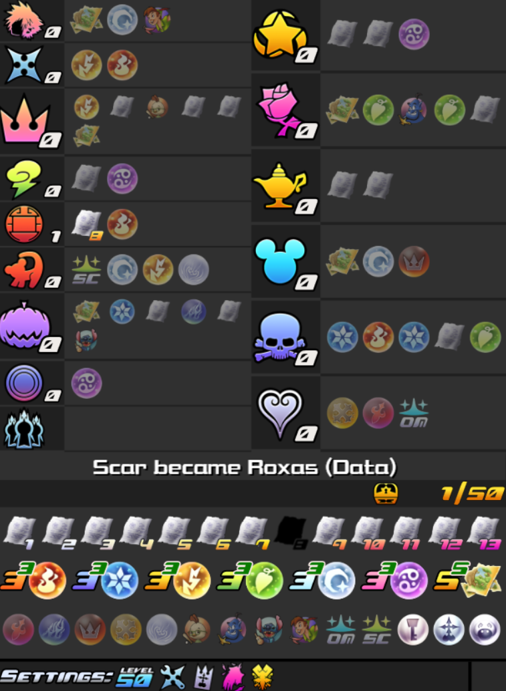

The report reveals the boss replacement "Armor(ed) Xemnas I became Hostile Program." This means that if you walked into Armored Xemnas I's arena, you would find that Hostile Program would be waiting there for you. Having 13 reports means that you get 13 boss enemy replacement hints. If you want to see a specific report's hint in DA's tracker, you can hover over it to reveals its contents.

<!--  -->

Another way to get these hints visualized is via the Battleship Tracker. Anytime you find a hint about a boss replacement, the arena in which you can find the boss will show up in the top right corner. So for example, because Hostile Program is in Armored Xemnas' I arena, a small Armored Xemnas image appears above Hostile Program.

Note that if some of the bosses are absent from the card, so are their hints, so you may not actually see all 13 hints on this tracker. If you want to see the hint for a boss not on the card, you can hover over reports in the main tracker as demonstrated in the gif above.

### Reports As Hints

In this hint system, each Secret Ansem Report gives information on the location of a single Important Check.

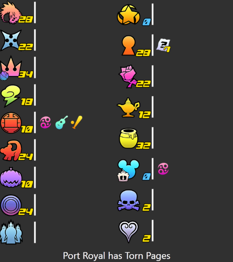

In the screenshot above, Secret Ansem Report 7 (found in Twilight Town) hints that Port Royal has a Torn Page.

### Options

If Proof-hinting reports is turned on, then reports also have a chance of directly telling you which location a proof is
in. Note: Even with this setting on, reports are not _guaranteed_ to hint all or even any Proofs.

## Path Hints

This hint system aims to leverage knowledge of where items are found in the original game to provide information about
where proofs may reside. This system is loosely inspired by Path to Reward hints from Ocarina of Time Randomizer.

As a baseline, the Shananas style tracking is in place, meaning that once you have collected all the hintable items in a
world, that world's number will turn blue. As long as it's yellow, there is something else "important" there. Path hints
make use of the reports in a way to point you toward proof locations.

When you collect a report, a hint text will appear, telling you about zero to three proofs, and references a world. As
an example, consider this example hint:

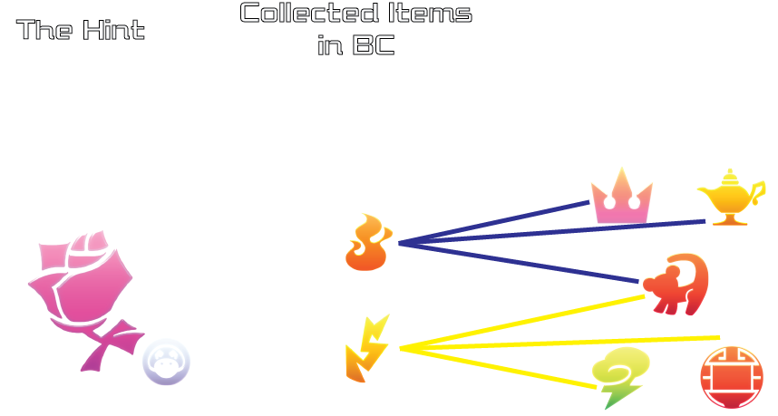

In this example, the report you found is telling you about Beast's Castle, and that the items you collect there will
create "paths" toward the Proof of Peace. In this example, you find Fire and Thunder, and since Fire is originally found
in Hollow Bastion, Agrabah, and Pride Lands, and Thunder is originally found in Pride Lands, Olympus Coliseum, and Land
of Dragons, one of those five worlds could have the Proof of Peace.

In this example, if there are no more important checks in Beast's Castle, and the number on that world in the tracker
turns blue, then you know 100% that the proof of peace must be in one of those five worlds. If there are items left to
collect, you may not know all the information yet.

Something more interesting can occur with path hints, where you may get information about multiple proofs at once:

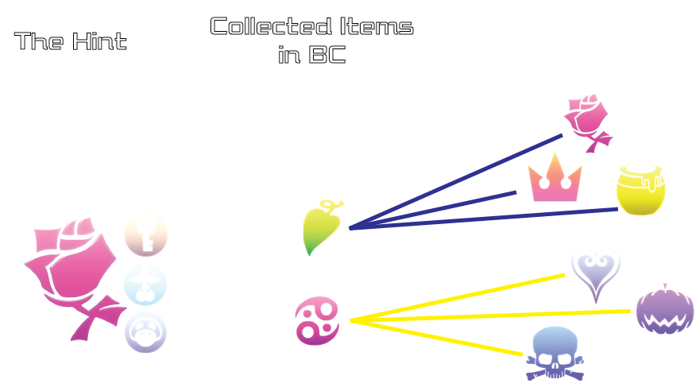

In this example, Beast's Castle "is on the path to all lights" meaning all proofs are hinted by the items found in
Beast's Castle. For this example, since Cure and Magnet are the only items found in Beast's Castle, all three proofs
must be in the six worlds above.

Another interesting hint you may receive involves when a world does not hint a proof:

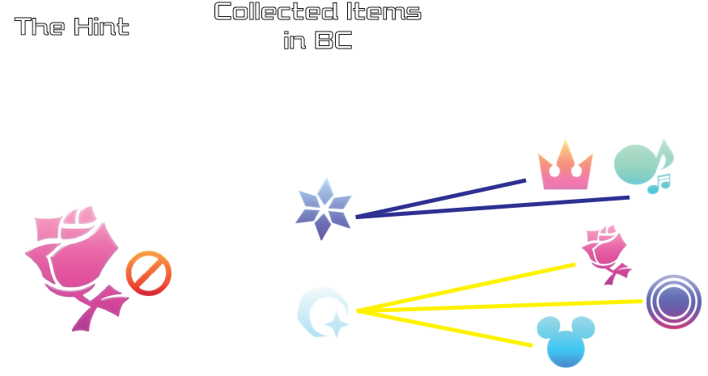

If a hint says that a world "has no path to the light", you know that any item you find in that world cannot point to a
proof.

As a guide, here is a cheat sheet for where the original locations of each item are considered:

### Original Locations Cheatsheet

Since the paths are determined by where the items are found in the vanilla game, here's a cheatsheet with what the
randomizer considers "original" locations.

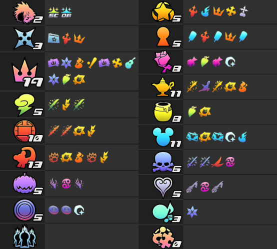

Or alternatively, here's a table based on the items and what worlds they can point toward:

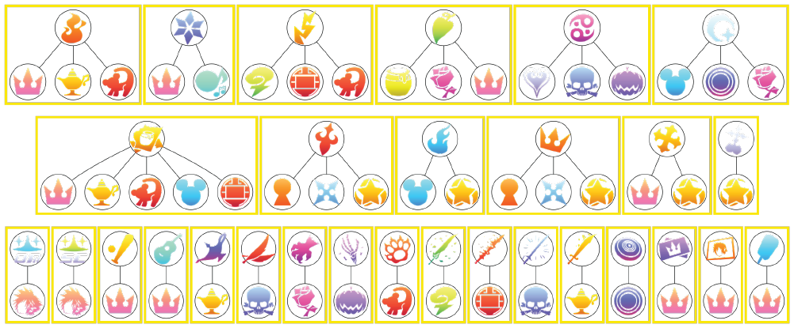

Feel free to save this onto your computer for reference.

Notable Callouts:

* Simulated Twilight Town and Twilight Town share the same original items for purposes of the hints, except for the 
  picture and ice cream items that unlock Twilight Town's second and third visits respectively.
* Drive Forms original items are the drive forms themselves, for purposes of the hints.
* The party member weapons used as keys for locking second visits are attributed to the world where that party member
  exists.
* Puzzles/Synthesis don't have any original items for the hints.
* The reports, proofs, Unknown Disk, Olympus Stone, and Hades Cup Trophy are not going to point to their original
  locations for purposes of the hints.

## Spoiler Hints

Spoiler Hints by default will reveal every Important Check each world has once the seed is loaded into the tracker by
tracking a transparent version of the Item to each of the worlds.

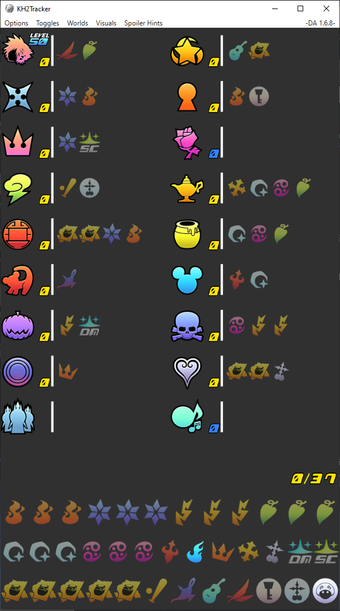

If desired, you can limit what is revealed by using the "Important Check Types to Reveal" setting to enable or disable
the different check types.

If the "Reports reveal worlds" option is enabled then all worlds will be hidden at the start only to be revealed when a
report is obtained.

In this example Ansem Report 3 is obtained and displays the text "Space Paranoids has been revealed!", after which it
displays all the Important Checks Space Paranoids has.

