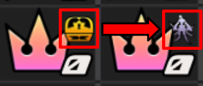
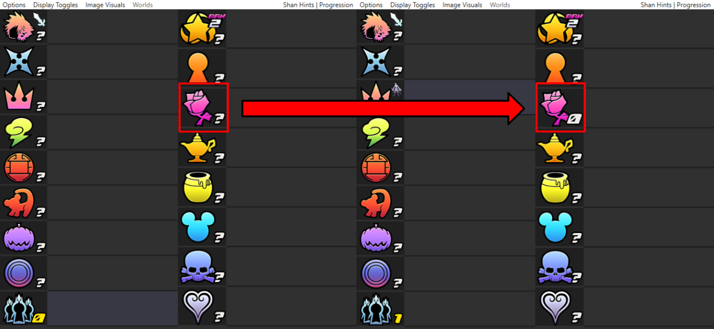
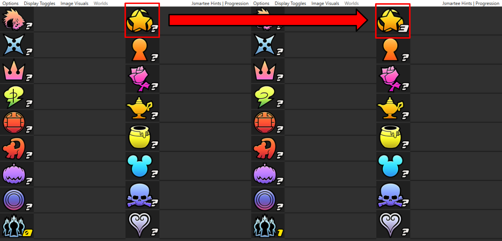
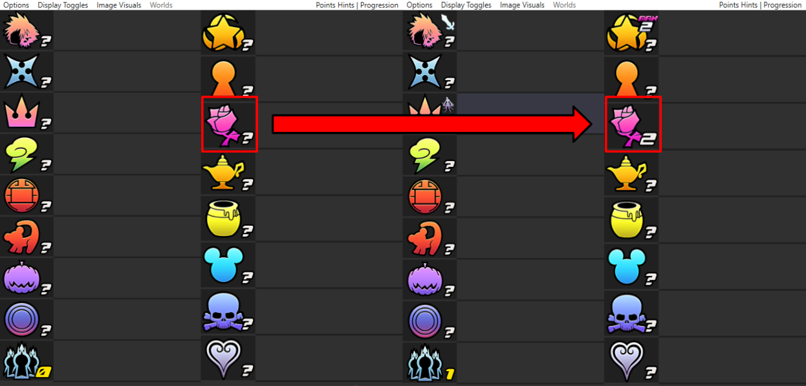
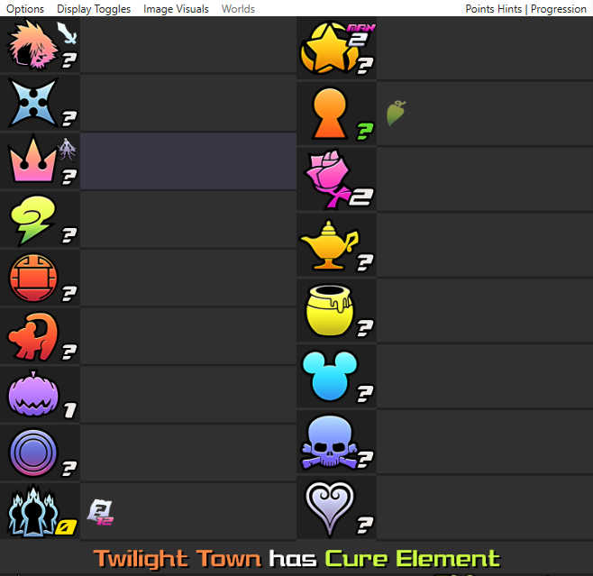
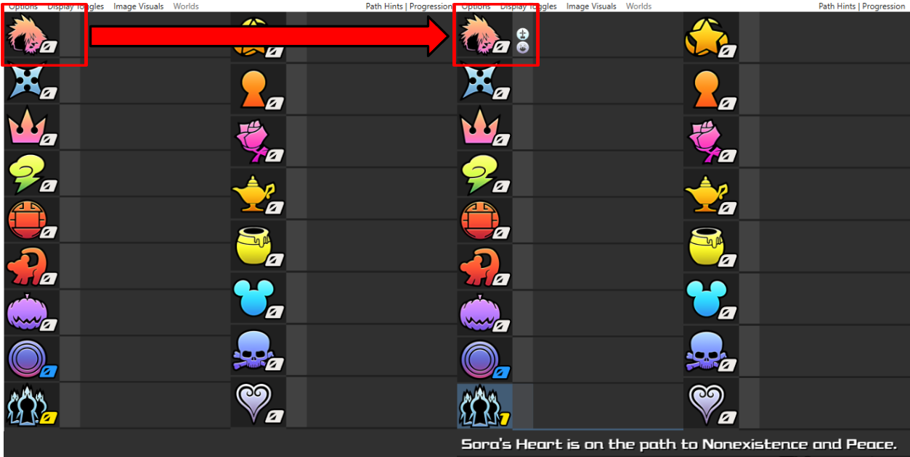
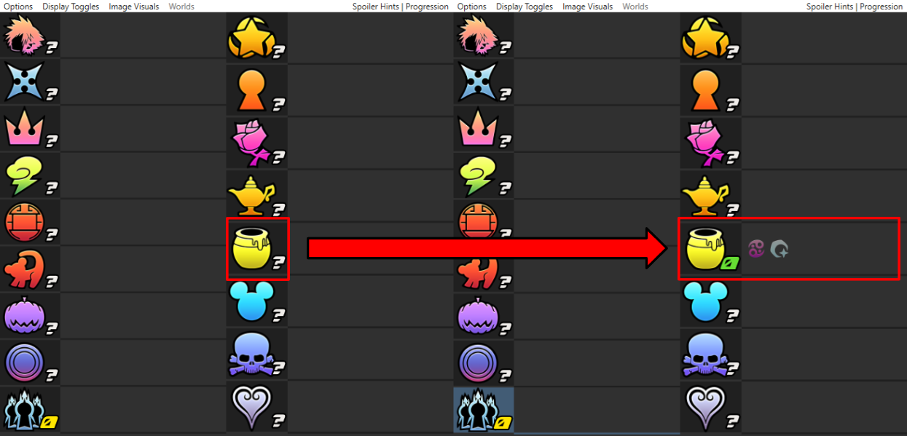

# Progression Hints

* [Summary](#summary)
* [Shananas Progression Hints](#shananas-progression-hints)
* [JSmartee Progression Hints](#jsmartee-progression-hints)
* [Points Progression Hints](#points-progression-hints)
* [Path Progression Hints](#path-progression-hints)
* [Spoiler Progression Hints](#spoiler-progression-hints)
* [Extra Progression Information](#extra-progression-information)

## Summary

Progression hints is a hint system modification for all hint systems. The main goal of progression hints is simply
defined as "Do content, get hint info". Progression hints serves as an alternative to Ansem Report-based hint systems.

You can enable progression hints in the seed generator by going to the Hints tab and enabling the
`Progression Hint Mode` toggle.

### World Progression

World progression is represented on the tracker by the icon located to the top-right of the world icon.

Each world has several predetermined progression points which are typically dictated by updates within the story
such as defeating a boss, a single or set of encounters, and so on. Not all cutscnes have progression tied to them.

Whenever you reach one of the moments that updates the icon, you will receive between 0-7 progression points. The
amount of points given can vary between each kind of story progression and this is configurable within the seed
generator.

### Checking Progression Points

When using progression hints, the important check count / points display will be replaced with a progression points
counter.

The number to the left of the slash indicates how many current progression points you have. The number to the right of
the slash indicates how many points are required to reveal the next hint(s) (referred to as a hint cost or hint
threshold). Whenever you reach/exceed the hint cost, a hint will be displayed based upon the hint system selected.
You can read the sections below to see how a hint is shown per hint system. The amount of hints and how much each hint
costs is configurable within the seed generator.

## Shananas Progression Hints

At the beginning of the seed, all locations will start off as question marks. When you reach the hint threshold, the
hinted location's important check count will change from a question mark to the current amount.

Once a location is hinted, the tracker will indicate when the location's last important check is found (like in a
non-progression Shananas hints seed). For information on how Shananas hints normally works, [click here](../shananas/index.md).

## JSmartee Progression Hints

At the beginning of the seed, all locations will start off as question marks. When you reach the hint threshold, the
hinted location's important check count will change from a question mark to the total amount of important checks the
location has.

Because progression hints is not Ansem Report-based, JSmartee Progression Hints does not have "hinted-hint" logic. It is
recommended that you disable Ansem Reports from being trackable in the seed generator when using JSmartee hints with
progression hints.

For information on how JSmartee hints normally works, [click here](../jsmartee/index.md).

## Points Progression Hints

At the beginning of the seed, all locations will start off as question marks. When you reach the hint threshold, the
hinted location's point total will change from a question mark to the remaining point total for the world.

For Points progression hints, Ansem Reports retain their secondary function of hinting important checks from locations.

Once a location is hinted, its number behaves the same as it would in a non-progression Points hints seed.
For information on how Points hints normally works, [click here](../points/index.md).

## Path Progression Hints

At the beginning of the seed, all locations will have their current important check counts shown. When you reach the
hint threshold, the hinted location will have its Path hint revealed.

Different to the other hint systems, a world's important check count will change from white to blue when the last
important check is found regardless if the world has been hinted or not.
For information on how Path hints normally works, [click here](../path/index.md).

Because progression hints is not Ansem Report-based, it is recommended that you disable Ansem Reports from being
trackable in the seed generator when using Path hints with progression.

For Path progression hints specifically, worlds that are initially revealed to have no important checks will be hinted
last in the reveal order. If there are multiple, they will all be hinted last.

## Spoiler Progression Hints

At the beginning of the seed, all locations will start off as question marks. When you reach the hint threshold, the
hinted location's important check count will change from a question mark to the current amount and all items highlighted
under `Reports Reveal Items` in the settings for the seed will be revealed.

Once a location is hinted, the tracker will indicate when the location's last important check is found (like in a
non-progression Spoiler hints seed). For information on how Spoiler hints normally works, [click here](../spoiler/index.md).

When setting up Spoiler progression hints, ensure that you set the `Report Reveal Mode` to `Reports` in the seed
settings. The seed will not generate as intended otherwise.

### Boss Replacement Hints

This hint system variation only appears when reports in Spoiler hints are set to `Reveal Boss Replacements`.

At the beginning of the seed, all locations will have their important checks "ghost-hinted". Every time a hint is
revealed with progression hints, a boss replacement hint will be given.

For example, the progression hint would say "Thresholder replaced Prison Keeper".

For this variation, the hint costs may be static.

## Extra Progression Information

### Auto-Tracking Requirement

Unlike Ansem Report-Based hint systems which allow you to place items manually on the tracker and place reports for
hints, progression hints relies on the auto-tracking functionality to update the world progression and track progression
points. Ensure that you are auto-tracking before playing a seed. If you make progress in a world but are not
auto-tracking, you will not be able to claim any missed progression points.

### Hint Order

The hint order is randomly determined per seed and is consistent per seed. For example, this means that if two people
play the same seed but do different starting content, their first hint will be the same regardless of the order players
did content in.

### Hint History

You can hover your mouse over the GoA icon on the tracker and use the scroll wheel to see all previously obtained hints.

### Progression World Complete Reward

When you get progression points in a location that is completed (the last important check is found), you will gain bonus
progression points based on the value set.

For example, let's say that The World That Never Was is complete at the start of a seed and that the `Progression World
Complete Reward` is set to 2. If you defeat Roxas, you will get the progression points for defeating him (for example,
3 points) and the `Progression World Complete Reward` (2 points) as well, giving you 5 points total.

> Note: if you were to get 0 points normally from world progression, you will still gain 0 progression points even with
> the `Progression World Complete Reward` configured.
>
> For balance reasons, this bonus does not apply to Sora Leveling and Drive Forms Leveling.

If a world has not been hinted yet by Progression Hints (except in Path Progression Hints), these bonus points are "banked".
For example, if the current hint system is Progression Points hints and The World That Never Was is still hidden/not
revealed and you defeat Roxas then leave the world immediately after, you will receive the normal point amount for
defeating Roxas (for example, 3 points). If you later reveal from a progression hint that The World That Never Was was
complete before you had defeated Roxas, then you will receive the "banked" 2 points when The World That Never Was is
hinted by progression hints.

### Progression Report Reward

For any seed where Ansem Reports are listed as trackable, obtaining an Ansem Report will give you progression points
based on the set amount. If you do not want Ansem Reports to give progression points, leave the value as 0.

### Leveling Bonus

For progression hints, leveling up Sora and each Drive Form will allow you to gain progression points.

For Sora levels, progression is set every 10 levels from level 10 to 50 (level 10, level 20, level 30, level 40, and
level 50).

For Drive Forms, progression is set every level from 2 to 7 (2, 3, 4, 5, 6, 7). These points are given to the individual forms.
For example, you can get progression points from both Final Form Level 5 and Wisdom Form Level 5 separately.

### Starting With Hints

When setting up the hint thresholds/hint costs list, if you set the first threshold to 0, upon auto-tracking you will be
given the first progression hint right away. If you set multiple 0's, then you will get multiple initial hints.

### Revealing Multiple Hints

When setting up the hint thresholds/hint costs list, if you set a hint threshold to 0, then that hint will be revealed
at the same time as the previous hint. This allows you to receive multiple hints from a single hint threshold.
