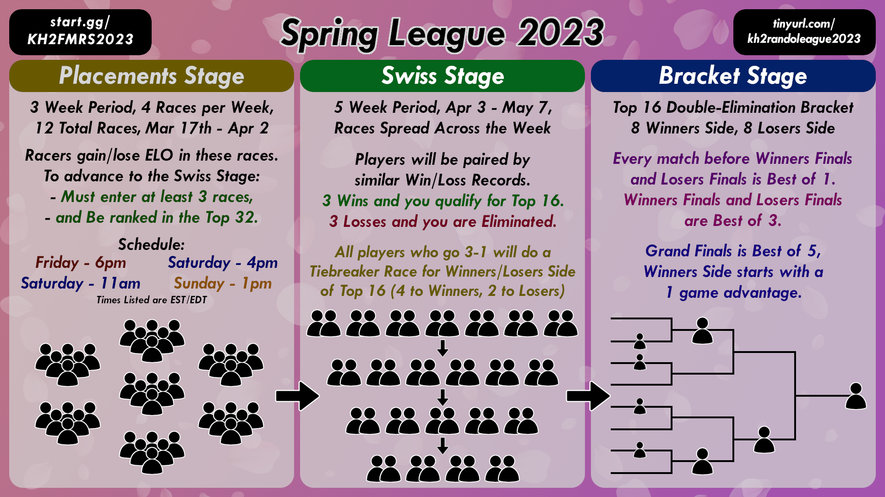

# League Format



There will be three stages to the league, a placement stage, a swiss stage, and a bracket stage. All stages will be coordinated via Discord, so join the discord to see updates.

## Placement Stage
In this stage, runners will join group races that are run for 3 weeks, 4 races per week. In these races, runners will gain/lose an ELO score (similar to racetime, but calculated by league orgs). The top 32 ranked runners will move onto the swiss stage. Rankings will be updated on kh2rando.com after each race. **Races will begin on March 17th** and will follow this schedule:

<iframe src="https://calendar.google.com/calendar/embed?height=600&wkst=1&bgcolor=%23ffffff&ctz=America%2FNew_York&showTitle=1&title=League%20Races&showNav=1&showDate=0&showPrint=0&showTabs=0&showCalendars=0&showTz=1&mode=AGENDA&src=ZjY4MmZmZThmMTM1ZmI0ZGRkNTA1OWEwZDIxZjY2MTFkY2M4MWVkNGY5MmY0ZjE3NjE4YWM2Y2E3YWJiMThjOUBncm91cC5jYWxlbmRhci5nb29nbGUuY29t&color=%23B39DDB" style="border:solid 1px #777" width="800" height="600" frameborder="0" scrolling="no"></iframe>

If you cannot make any of these times, you are allowed to contact a league organizer/assistant to async the Friday race on Thursday. While there are several volunteers to facilitate this, we can't guarantee availability. We will be as accommodating as possible.

### Notes
```
- You must join 3 races minimum to advance.
- If you race with an outdated GoA mod or outdated KH2Tracker, you've effectively not raced a league seed, so will not count toward your 3 minimum races.
```


## Swiss Stage
In this stage, players will be paired off for 1v1 races, initially based on ELO gained during placement races (1st vs 17th, 2nd vs 18th, 3rd vs 19th, etc.), but after each round, you will be paired based on your win/loss record. If you obtain 3 wins in this stage, you advance to the bracket stage. If you lose 3 times, you are eliminated. Top 8 ranked runners will be placed on the winners' side of the bracket, and Top 9-16 will be placed on losers' side of the bracket. With the way wins are accumulated, there will be a runoff race for runners with a 3-1 record to determine who gets into winners'.

### Notes
```
There will be 4 3-0 runners, who will be seeded 1-4 in winners' (based on ELO score accrued the entire league)
There will be 6 3-1 runners, who will do a runoff race to determine who will be in Top 8 or not. 4 of these racers will be seeded 5-8 in winners' and 2 will be seed 1-2 in losers
There will be 6 3-2 runners, seeded 3-8 in losers'
```

## Top 16 Bracket Stage
As previously stated, the bracket stage will consist of 8 players in winners' bracket and 8 players in losers' bracket. It's a double elimination bracket. Winners' and Losers' Finals will be best of 3, Grand Finals will be best of 5 with Winners' bracket having a 1 game advantage. 


## Additional Rules
After the initial settings release, it has been determined that while the "traditional" rando CoR skip has been disabled by settings, it has become significantly more feasible to do a "full" CoR skip to avoid the forced fight and load zone into the Depths upper level. This is not the intent of the organizers, so drive recoveries will be removed from the shop and *skipping into Cavern of Remembrance at all is not allowed!* If you are discovered doing so, you will forfeit that race.