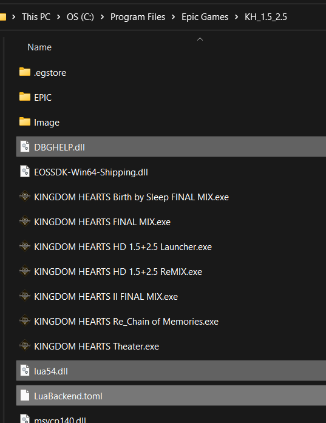

# LuaBackend Hook Setup

These instructions guide you through installing LuaBackend Hook and performing the necessary configuration for
integration with KH2 Randomizer using OpenKH Mods Manager.

## Installation

* Download the [DBGHELP.zip](https://github.com/Sirius902/LuaBackend/releases/latest/download/DBGHELP.zip) file
* Copy the contents of `DBGHELP.zip` to your Games Install folder. This folder is usually located at
  `C:\Program Files\Epic Games\KH_1.5_2.5` and contains the game executables such as
  `KINGDOM HEARTS II FINAL MIX.exe`. Once you've copied the files there, the folder should look something like this:



## Configuration

* Open the `LuaBackend.toml` file in Notepad or another text editor. The top of the `kh2` section should look something
  like this when you start:

```toml
[kh2]
scripts = [{ path = "scripts/kh2/", relative = true }]
```

* Edit this section to add the location of your OpenKH installation (adding `/mod/scripts` at the end) as an
  additional location for scripts. For example, if you have OpenKH installed at `C:\kh2rando\openkh`, edit the `scripts`
  part of the `kh2` section to look like the following (the forward slashes rather than backslashes are important):

```toml
[kh2]
scripts = [
    { path = "scripts/kh2/", relative = true },
    { path = "C:/kh2rando/openkh/mod/scripts", relative = false }
]
```

## Removing Duplicate Scripts

You may need to remove some scripts from your old scripts folder that would now be duplicated. For example, if you're
using the current GoA ROM, you'll need to remove the `F266B00B GoA ROM.lua` file _and_ the Quality of Life Lua file
from your `Documents\KINGDOM HEARTS HD 1.5+2.5 ReMIX\scripts\kh2` folder.
