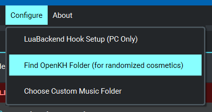
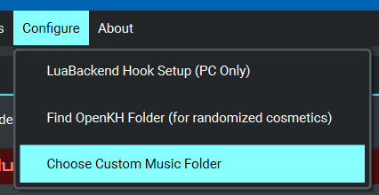

# Randomized Music

The KH2 Randomizer supports randomizing songs from some Kingdom Hearts games, as well as your own custom songs.

* [General Options](#general-options)
* [Kingdom Hearts Songs](#kingdom-hearts-songs)
* [Custom Songs](#custom-songs)

## General Options

### Randomize Music

Controls whether music randomization is active.

### DMCA Safe

Check this option to exclude songs from the randomized music pool that are known to have some copyright concerns.

### Categorize Songs

Controls whether songs are replaced only by other songs in the same category. For example,
"boss" songs can be replaced by "boss" songs, "cutscene" songs can be replaced by "cutscene" songs, and so on.

Leaving this option unchecked means any song in the game can be replaced by any song in the randomized music pool.

### Allow Duplicate Replacements

Check this option if you don't have enough songs available to replace all the game songs, but you'd like only songs
from your randomized music pool to be used (even if it means some songs will be re-used).

With this option disabled, once the music randomizer runs out of replacement songs, it will not replace any further
songs from the game, and some songs will remain unchanged.

## Kingdom Hearts Songs

There are options to include songs from some Kingdom Hearts games into the randomized music pool.

If you haven't yet configured the seed generator to point to your OpenKH folder, these options will be disabled. To
configure this, choose `Find OpenKH Folder` in the `Configure` menu.

Each game's option may also be disabled if you haven't extracted that game's data using the setup wizard in OpenKH Mods
Manager.

## Custom Songs

You can use your own `.scd` files as part of the music randomizer. There is an `Include Custom Songs` option that
controls whether custom songs are included in the randomized music pool.

> Creating/obtaining `.scd` files is outside the scope of this page.

### Setup

If you haven't chosen a custom music folder yet, you should see a message indicating `Custom music folder not
configured`. To configure this, choose `Choose Custom Music Folder` in the `Configure` menu.

Choose a folder where you will place your custom songs. Once you've done this, the seed generator creates several
sub-folders within this folder representing various music categories.

### Basic

If you just want all of your songs to be randomized anywhere in the game, place all of your `.scd` files within the
`wild` folder. You can create additional sub-folders within the `wild` folder for organization of your song files as
desired.

### Intermediate

If you'd like to categorize your songs so that certain ones are played for the title screen only, certain ones play only
during battle, etc., place your `.scd` files into the various folders that represent those categories. You can create
sub-folders within any of the categories for organization of your song files as desired.

> You can look at the `musiclist.json` file in the folder where you installed the seed generator to see which KH2
> songs belong to each category.

### Advanced

If you'd like even more control over music categories, you can create your own additional category folders, and you can
edit the `musiclist.json` file (located in the folder where you installed the seed generator) to configure the
category/categories of each song. Songs can be given multiple categories, and a replacement song will be chosen from one
of those categories. A category can be repeated in the configuration to give a certain category more "weight".

Using this technique, you can get as precise as having a set of custom song options for each world, or even a set of
custom song options that can replace just one song from the game.
