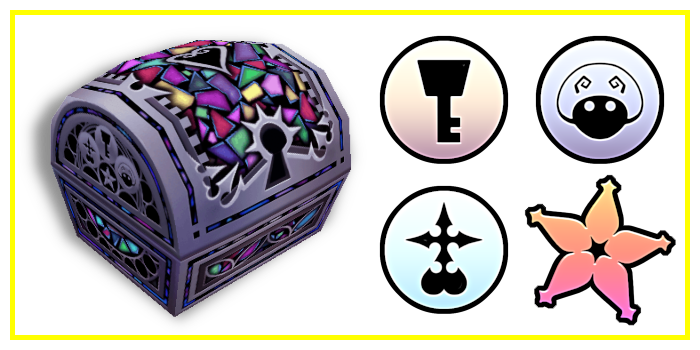
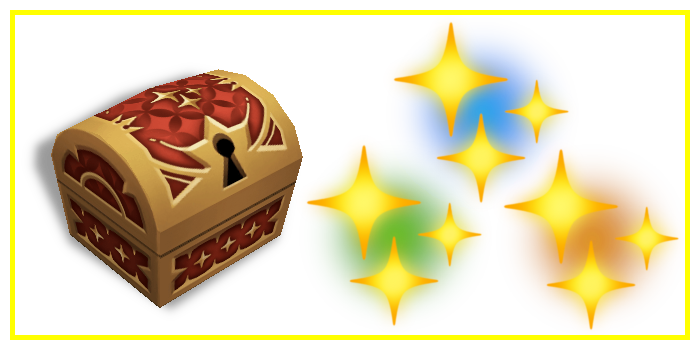
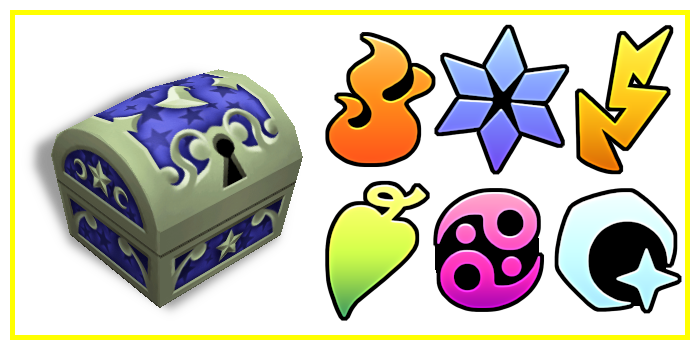
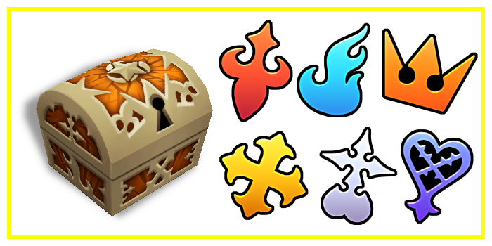
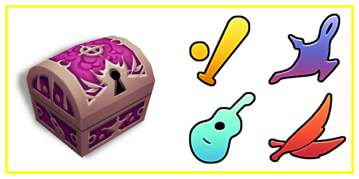
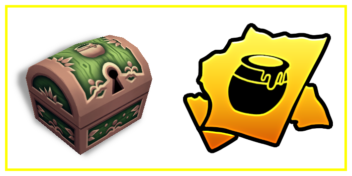
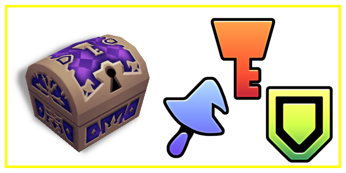
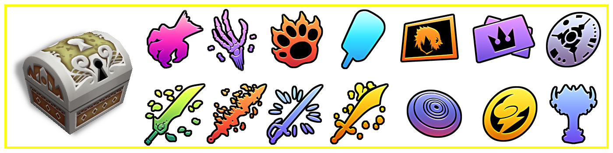
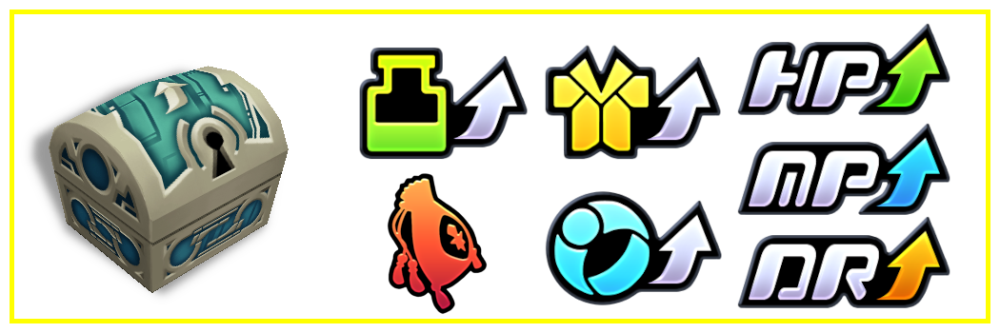
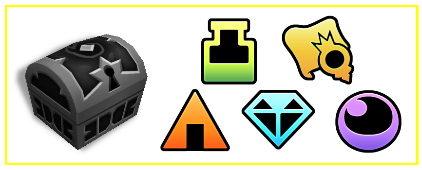

# Chest Visuals

When the _Chest Visuals Match Contents_ setting is enabled, treasure chests will visually indicate the type of item they
contain. Items are categorized as follows:

| Visual                                              | Category                                                                        |
|-----------------------------------------------------|---------------------------------------------------------------------------------|
|                        | Proofs (including Promise Charm)                                                |
|                  | Abilities (growth, action, and support)                                         |
|                          | Magic                                                                           |
|                   | Drive Forms (including Anti-form if enabled)                                    |
|                      | Summons                                                                         |
|                     | Torn Pages                                                                      |
|         | Secret Ansem Reports                                                            |
|                      | Weapons (keyblades/staffs/shields)                                              |
|  | Armor, accessories                                                              |
|                      | Visit Unlocks (also includes Olympus Stone, Hades Cup Trophy, and Unknown Disk) |
|                          | Stat/Slot Increases (also includes Munny Pouches)                               |
|                            | Everything else                                                                 |
