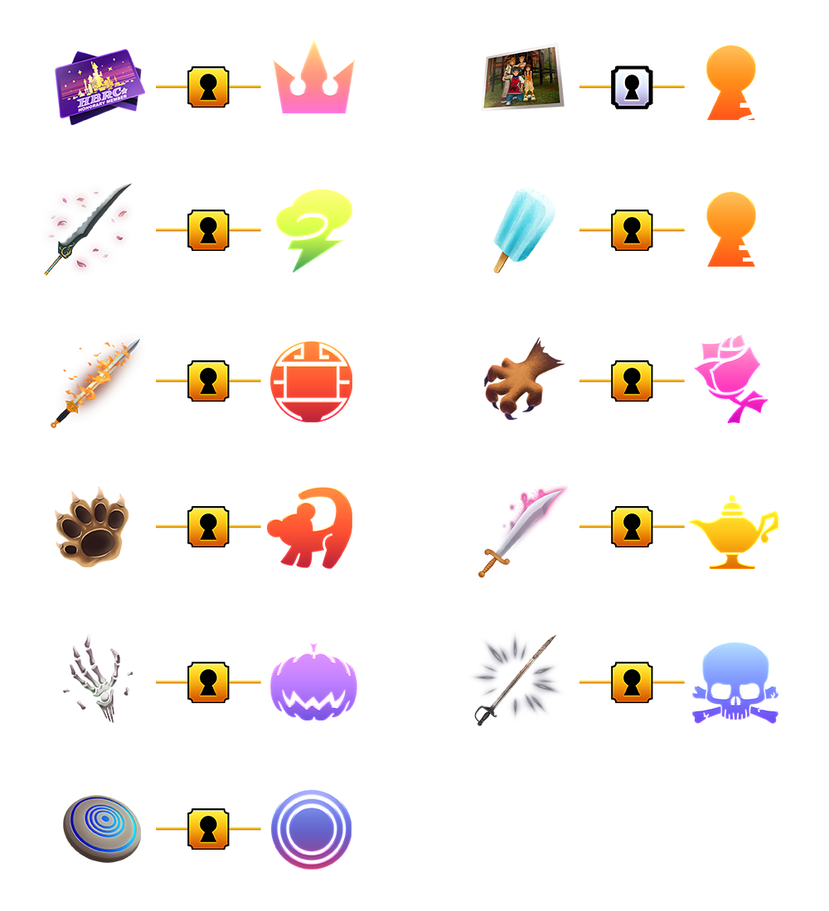

# Seed Generator

* [General / FAQ](#general--faq)
* [Options](#options)
    * [Menus](#menus)
    * [Levels/EXP/Stats](#levelsexpstats)
    * [Starting Items](#starting-items)
    * [Hints](#hints)
    * [Keyblades](#keyblades)
    * [Reward Locations](#reward-locations)
    * [Item Placement](#item-placement)
    * [Seed Modifiers](#seed-modifiers)
    * [Boss/Enemy](#bossenemy)
    * [Cosmetics](#cosmetics)

# General / FAQ

### What version of Kingdom Hearts II can this be used with?

This seed generator can be used with either the PC (Epic Games Store) or PCSX2 (emulated) version of Kingdom Hearts II:
Final Mix. This will not work with Kingdom Hearts II (US PS2), and is not supported on the console versions of the game.

### What are the differences between this and [Valaxor's Seed Generator](https://randomizer.valaxor.com/#/seed)?

This seed generator is designed to be used with the [OpenKH](https://openkh.dev/) Mods Manager. This enables some extra
features:

* Cosmetic randomization
    * Randomized command menus on both PC and PCSX2
    * Randomized music on PC (including custom music)

* Boss/Enemy Randomizer
    * Field enemies are now randomized
    * Certain bosses that were not reasonable to randomize can now be randomized
    * Boss/Enemy randomization on PC

* Puzzle Reward Randomization option
* Synthesis Item Randomization option

* QoL options like giving 
    * Optional Roxas animations for magic, Trinity Limit, and movement, allowing a larger range of combat options.
    * Optional Port Royal Map Replacement to avoid the crashes on the PC version
    * Optional Magic Carpet Skip in Agrabah's second visit, which skips the autoscroller

Other differences include:

* No "Vanilla" option for any randomization setting
* More item placement logic options
* Additional seed modifiers
* Starting inventory options
* All armor and accessories exist in the item pool
* Once all items are placed, all remaining slots are filled with random Synthesis Materials or Consumable items

### What is a Seed Hash?

A sequence of images generated and stored along with the seed. The seed hash is displayed several places.

* The seed generator itself
* The item tracker
* The New Game screen in the game itself

The hash can be used for multiple purposes.

* Ensuring the seed you're about to start matches the one you have loaded into the tracker
* Ensuring all players in a race or co-op format have the same seed
    * It's common to post a screenshot of the seed hash before a race starts for all racers to compare against

### Why are Consumables considered "junk"?

"Junk" is a bit of a misnomer. After all "one-off" items (equipment, abilities, Important Checks, maps) are placed, all
remaining locations are filled randomly with Synthesis Materials or Consumables, as the quantity of those per seed don't
necessarily matter. So the term "junk" in this context includes things like Potions, AP Boosts, Drive Recoveries, etc.

# Options

## Menus

### Share Seed

**Save Seed to Clipboard** - Copies information about the currently configured seed to the clipboard so that you can
send the same seed to other players. This is the recommended way to share seeds (sharing the seed `.zip` file itself is
not guaranteed to work, especially if custom cosmetics are used).

**Load Seed from Clipboard** - Loads a seed configuration from the clipboard into the generator

### Preset

**Open Preset Folder** - Opens the folder containing preset configurations. Can be useful for sharing presets with
others, or renaming or deleting a preset.

**Save Settings as New Preset** - Saves the current settings as a preset configuration that can be quickly chosen later

**Presets** - Lists the presets available for choosing

### Load Daily Seed

Loads the current day's [daily seed](../daily-seeds/index.md) into the generator.

### Find Extracted PC KH Data

Displays a folder chooser allowing you to configure the location of the extracted data from your Kingdom Hearts
game/games.

* This is currently only used for music randomization on PC only
* The folder you should choose is the one that contains sub-folders for `kh2` (and maybe others)
* Once the folder is chosen, restart the seed generator for your game/games to display in the music randomizer options

### Seed

The name of the seed to generate. The seed settings, along with this name, determine the placement for all things
randomized by the generator.

### Make Spoiler Log

If enabled, adds a file to the generated seed `.zip` file detailing the locations of all the randomized items, as well
as other information about the seed.

* Note that enabling/disabling the spoiler log results in 2 completely different seeds, to prevent someone who knows a
  seed name from generating a spoiler log for a seed that was not intended to have a spoiler log (i.e. a seed for a race
  or tournament)

### Rando Settings

If enabled, several seed settings will be chosen at random.

* Worlds/Bosses/Misc Locations will only be turned _off_ randomly, so anything that is set to off before generating a
  seed will stay off (i.e. if Datas are off, they will stay off)

## Levels/EXP/Stats

**Sora Levels** - Controls the maximum level that can contain a non-"junk" randomized reward

* Level 1 - All level-up rewards are guaranteed to be junk
* Level 50 - All level-up rewards past level 50 are guaranteed to be junk
* Level 99 - All level-up rewards can be non-junk

**Dream Weapon Matters** - At the beginning of a seed, the dream weapon you choose will determine when you get items from 
levels. When disabled, all weapons will give the same items on the same levels.

**Level 1 Mode** - Only visible when Level 1 is chosen above. Provides no stats on level up and removes the vanilla level abilities from the item pool.

**Form Level Rewards** - If enabled, Drive Form level-ups can contain non-"junk" randomized rewards

**Glass Cannon** - Prevents Defense increases from appearing in the level-up randomized rewards pool

**Sora Starting AP** - Sora begins the game with this much AP

**Donald Starting AP** - Donald begins the game with this much AP

**Goofy Starting AP** - Goofy begins the game with this much AP

**Experience Multipliers** - Adjust the amount of experience needed to reach each level

* Example: If the game normally requires 1000 EXP to reach level 2, setting the multiplier to 2.0 changes the game to
  require only 500 EXP to reach level 2

**Experience Curves** - Inspired by a similar concept in Kingdom Hearts I.

* Dawn (Normal) - The default EXP rate
* Midday - Early levels (up to 50 for Sora, levels 2-4 for Drive Forms and Summons) have their required EXP increased,
  but later levels have their required EXP reduced.
* Dusk - Early levels (up to 50 for Sora, levels 2-4 for Drive Forms and Summons) have their required EXP further
  increased, but later levels have their required EXP reduced even more

## Starting Items

**Critical Bonuses** - If enabled, the 7 starting items on Critical Mode can contain non-"junk" randomized rewards

* Only enable this option if you plan to play on Critical Mode, or you may prevent yourself from obtaining those
  randomized rewards

**Garden of Assemblage** - If enabled, the 3 chests in the Garden of Assemblage can contain non-"junk" randomized
rewards

**Growth Ability Starting Level** - Select how many growth abilities you want to start with.
* None
* 5 Random - Pick 5 individual growth abilities to add at the start. E.g. you could start with Lv1 High Jump, Lv1 Dodge Roll, and Lv3 Glide.
* Level 1 - Same as the "Schmovement" setting previously. All growths start at level 1.
* Level 2 - All growths start at level 2.
* Level 3 - All growths start at level 3.
* Max - All growths start at max level.

**Library of Assemblage** - If enabled, the game begins with all 13 Secret Ansem Reports acquired. This can be useful in
hint systems where Secret Ansem Reports give hints.

**World Key Items** - If enabled, the game begins with all worlds unlocked. If disabled, you will need to search 
the open worlds to find the items to unlock the second visits to different worlds. A table of what unlocks each world is below:

> Quick Tip: To make sure the game can update story flags when you collect a key item, you need to trigger a cutscene or enter The World that Never Was. That will update the game, and you can continue that world.

**Starting Inventory** - Begin the game with each selected item/ability already acquired

## Hints

**Hint System** - Controls which hint system to use

* See the main [Hints](../hints/index.md) page for explanations of the different hint systems and their options

## Keyblades

**Keyblade Min/Max Stat** - Controls the minimum and maximum strength and magic stat that each keyblade can have

**Support/Action Keyblade-Eligible Abilities** - Controls the abilities that are eligible to be randomized onto
keyblades. Any abilities not selected are guaranteed to not be attached to a keyblade.

* Note that there must be enough keyblade-eligible abilities chosen such that each keyblade gets an ability, or the seed
  will fail to generate

## Reward Locations

Controls which worlds/locations can contain non-"junk" randomized rewards. Anything not selected is guaranteed to
contain only junk. Any `Misc Location` can be enabled independent of what world it normally is in, e.g. Olympus Cups 
can be enabled without enabling Olympus Coliseum.

## Item Placement

### Include in Item Pool

**Bonus Rewards as Items (Statsanity)** - If enabled, takes HP, MP, Drive, Accessory Slot, Armor Slot, and Item Slot
upgrades from the normal bonus popup locations and lets them appear in chests or other randomized locations. Those bonus
popup locations can now have other randomized rewards.

**50 AP Boosts** - Adds guaranteed 50 AP Boosts into the item pool.

**Promise Charm** - If enabled, the Promise Charm item will be added to the randomized item pool, which can allow
skipping The World That Never Was by interacting with the computer in the Garden of Assemblage once you have all 3 Proof
items as well as the Promise Charm

**Pureblood Keyblade** - Pureblood is a keyblade that mods over the existing `Antiform Dummy` item, and is added to the item
pool with this option. Due to some reports of outdated installations crashing with this in the item pool, you can disable this option
if you experience such issues. It is recommended however to make sure your installation is up-to-date. 

**Maps** - Adds maps to the item pool

**Synthesis Recipes** - Adds synthesis recipes to the item pool. Recipes are NOT required when synthesis rewards are randomized.

**Ability Pool** - Controls the presence and amount of abilities in the randomized pool

* Default Abilities - uses the default set of action and support abilities
* Randomize Ability Pool - picks Sora's action/support abilities at random (guaranteed to have one Second Chance and one
  Once More ability)
* Randomize Support Ability Pool - leaves Sora's action abilities alone, but will randomize the support abilities (still
  guaranteed to have one Second Chance and one Once More)

### Junk Items

**Junk Items** - Once all of the required items are placed, items from this list are used to fill the remaining
locations. This item pool is also used for worlds/locations that are disabled.

### Where Items Can Go

**Softlock Prevention** - An option to change the softlock prevention method in use. Default option is `Regular Rando` which is correct for most cases,
but if you play reverse rando or are doing a co-op with someone playing reverse rando, you can select other softlock preventions options for those
cases.

**Item Placement Difficulty** - Configures the placement of items to be biased based on how easy/difficult you would
like the seed to be. Items have four categories (Common, Uncommon, Rare, Mythic) that influence what bias each item gets
when placing those items. Super Easy and Easy will bias Rare and Mythic items early, while placements harder than Normal
will bias those items later.

**Advanced Nightmare Logic** - If enabled, auto forms (Auto Valor, Auto Wisdom, etc.) may be required to make progress in your seed. 
And if item placement difficulty is used, keyblades with good abilities will be weighted as well.

**Key Item Category** - Used in tandem with `Item Placement Difficulty`, the items used to unlock second visits of worlds can be changed 
between the four item categories (Common, Uncommon, Rare, Mythic).

**Key Item Depth** - Set a certain group of locations where you can find the visit locking key items. 

**Yeet The Bear Required** - If enabled, forces the Proof of Nonexistence onto the popup reward from 100 Acre Wood -
Starry Hill, thus requiring The Hunny Pot minigame to be completed in order to obtain the Proof.

**Proof Depth** - Configures where the three Proof items can be placed.

## Seed Modifiers

### Quality of Life

**Roxas Magic/Movement/Trinity** - If enabled, Roxas will be given all the animations of Sora, allowing for the use of all actions in 
Simulated Twilight Town.

**Early Twilight Town 1 Exit** - If enabled, save points in the first visit of Twilight Town will allow you to leave back to the Garden of Assemblage. 

**Skip Magic Carpet Escape** - If enabled, the entire autoscrolling segment of Agrabah's second visit after exiting the Ruined Chamber will be skipped.

**Remove Port Royal Map Select** - If enabled, the map for the boat travel in Port Royal will be replaced with text options. Useful to avoid crashes that are more likely on PC.

### Other Modifiers

**Split AS/Data Rewards** - Controls how rewards are given for Absent Silhouette fights

* If enabled, Absent Silhouette rewards will _NOT_ give the reward from their Data versions. You must beat the Data
  version to get the Data-specific reward.
* If disabled, beating the Absent Silhouette gives rewards from the Data version as well as the Absent Silhouette
  version

**Cups Give XP** - If enabled, experience for party members and Drive Forms can be earned while in an Olympus Coliseum
cup

**Retry Data Final Xemnas** - If enabled, if you die to Data Final Xemnas, Continue will spawn you right back into the
fight, instead of having to fight Data Xemnas I again
* **Warning** - if you are unable to beat Data Final Xemnas, there is no way to exit, essentially causing a softlock, and you'll have to load a save.

**Retry Dark Thorn** - If enabled, if you die to Dark Thorn (Beast Castle first visit boss), Continue will spawn you right back into 
the fight, instead of having to fight Shadow Stalker again. Especially useful in Boss rando.
* **Warning** - if you are unable to beat Dark Thorn, there is no way to exit, essentially causing a softlock, and you'll have to load a save.

**Remove Damage Cap** - Removes the damage cap for every enemy/boss in the game

## Boss/Enemy

**Boss Randomization Mode** - Controls if and how the bosses should be randomized.

* One-to-One - just shuffles around where the bosses are located, but each boss is still present (some bosses may be
  excluded from the randomization)
* Wild - randomly picks an available boss for every location, meaning some bosses can be seen more than once, and some
  may never be seen. If a selected boss is filled in, this setting is ignored and every boss (almost) will become that
  boss.

**Selected Boss** - Replaces every boss possible with the selected boss. Depending on the boss, this may not result in a
completable seed. This value is ignored if Boss Randomization Mode is not "Selected Boss".

**Nightmare Bosses** - If enabled, replaces bosses using only the most difficult bosses in the game, and forces Boss
Randomization Mode to be "Wild".

**Bosses Can Replace Enemies** - If enabled, replaces 0.5 percent of enemies in the game with a random boss. This option
is intended for PC use only.

**Randomize Cups Bosses** - If enabled, includes the Olympus Coliseum cups bosses in the randomization pool

**Randomize Superbosses** - If enabled, includes the Data versions of Organization XII members in the pool, as well as
Lingering Will (Terra) and Sephiroth

**Mickey Appearance Settings** - Choose when Mickey appears.

* follow - Mickey appears for the same bosses as in the vanilla game, regardless of their location
* stay - Mickey appears in the same locations as in the vanilla game, regardless of the bosses placed there
* all - Mickey will appear for every boss in the game, regardless of whether Mickey normally apepars there
* none - Mickey will never appear. Might make PCSX2 boss fights less stable.

**Enemy Randomization Mode** - Controls if and how the enemies should be randomized.

* One-to-One - simple 1:1 replacement (i.e. all Shadows become Dusks)
* One-to-One per room - similar to One-to-One but every room is re-randomized (so Shadows in Parlor might be Ice Cubes,
  but in Land of Dragons Cave they might be Fire Cubes)
* Wild - every enemy entity in the game is completely randomized (this is probably unstable and is only available for
  PC). If a selected enemy is filled in, this setting is ignored, and every enemy (almost) will become that enemy.

**Selected Enemy** - Replaces every enemy with the selected enemy. Depending on the enemy, this may not result in a
completable seed. This value is ignored if enemy randomization mode is not "Selected Enemy".

**Nightmare Enemies** - Replaces enemies using only the most difficult enemies in the game

**Combine Enemy Sizes** - Normally, small enemies are randomized separately from big enemies to prevent crashing. On PC
(where this is less likely to crash), small and large enemies are no longer randomized separately if this option is
enabled.

* **Warning** - this setting is experimental and may cause bad crashes

**Combine Melee and Ranged enemies** - Normally, ranged and melee enemies are randomized separate from each other, both
for difficulty and to reduce crashing. On PC (where this is less likely to crash), ranged and melee enemies are no
longer randomized separately if this option is enabled.

* **Warning** - this setting is experimental and may cause bad crashes

## Cosmetics

**Command Menu** - controls the appearance of the command menu on-screen

* Vanilla - command menus will have their normal appearance
* Randomize (one) - chooses a single random command menu to use for the entire game
* Randomize (all) - chooses random command menus for each world/location that has a unique command menu
* individual command menus - force all command menus to have the chosen appearance

**Music** - controls randomized music (PC version only)

* See the main [Randomized Music](../music/index.md) page for instructions.
