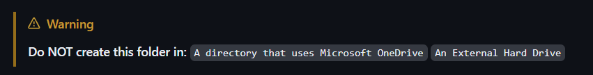
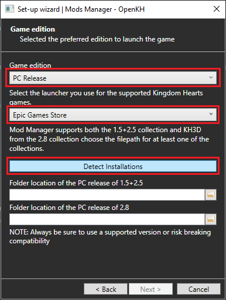
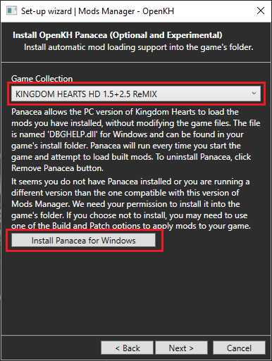
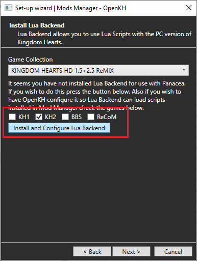
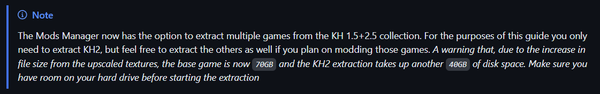
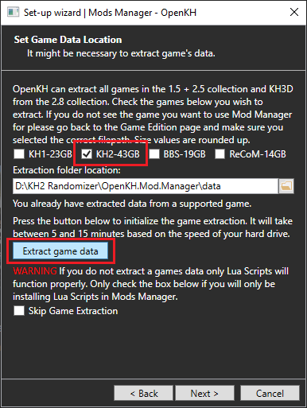
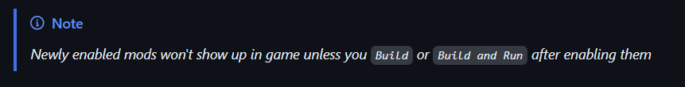

# PC - Steam and Epic Mod Manager and Garden of Assemblage mod Setup Guide

* [Heads up!](#heads-up)
* [Downloads](#downloads)
* [Installing the Mods Manager](#installing-openkh-mods-manager)
* [Setting up the Mods Manager](#setting-up-openkh-mods-manager)
* [Installing the GoA mod](#garden-of-assemblage-mod-installation)

## Heads up!
* Feel free to go to the [Discord server](https://discord.gg/vKhdwNAmzE) for help with the setup, there is a dedicated #help channel where you can find people to assist you if you're facing any difficulties. (P.S. Please be polite)
* `You must run the game once` before you start the guide. Otherwise it may not boot up correctly after the randomizer is installed.
* `VERIFY GAME FILES` through Steam/Epic for Kingdom Hearts 1.5 + 2.5 Remix (v1.0.0.10_WW), they need to be clean/unpatched files for the extraction process to work.
* If you have EVER installed the KH2 Randomizer before then please check if you have a folder at `C:\Documents\My Games\KINGDOM HEARTS HD 1.5+2.5 ReMIX\scripts\kh2` (for Steam) or `C:\Documents\KINGDOM HEARTS HD 1.5+2.5 ReMIX\scripts\kh2` (for Epic) and EMPTY IT. You may have outdated lua files located there.
* Unofficial copies of the game are not supported. It is strongly recommended you buy and install the game directly from either the Steam or Epic Games stores.

## Downloads:
* [OpenKH Mods Manager](https://github.com/OpenKH/OpenKh/releases/download/latest/openkh.zip)
  - The program you will be downloading and installing mods to. It can directly download mods hosted on github, as well as locally downloaded mods with the `lua`, `.zip`, and `.kh2pcpatch` file types (other KH game .pcpatch files are also supported)
* [.NET 8 Desktop Runtime](https://builds.dotnet.microsoft.com/dotnet/WindowsDesktop/8.0.20/windowsdesktop-runtime-8.0.20-win-x64.exe)
  - Software required to run the OpenKH Mods Manager

## Installing OpenKH Mods Manager
1. Start by downloading the 3 programs from the download links above
2. Install the .NET Desktop Runtime by running the `windowsdesktop-runtime-8.0.20-win-x64.exe` executable you just downloaded
3. Create a `KH2 Rando` folder (you may give it any name) on the same hard drive you have the game installed. This is where we will be installing the `Mods Manager` and `Seed Generator`

4. Extract the `OpenKH Mods Manager` to the "KH2 Rando" folder 
	- It's recommended to give each app its own subfolder to make navigating their files easier (See screenshot)

## Setting Up OpenKH Mods Manager:
1. Find and run the `OpenKh.Tools.ModsManager.exe` from inside the OpenKH installation folder 
	- The Setup Wizard will open automatically, click `Next` to start

2. Click on the `Game Edition` drop-down menu and select `PC Release`
3. In the next drop-down menu, choose `Epic Games Store` as your launcher (or `Steam` if you have the Steam version)
4. Once you have selected the launcher, click on the `Detect Installations` button to have the wizard automatically locate your game install folders (KH 2.8 is also supported by the Mods Manager but is not required to complete the setup)
   * If the wizard fails to automatically detect your game install folder you will need to manually navigate to it by clicking the folder icon on the right of the input line
5. Once your game folder is found, click `Next`

    

6. On the `Panacea` installation page, first set the `Game Collection` drop-down menu to `KINGDOM HEARTS 1.5 + 2.5 ReMIX`
7. Then, click the `Install Panacea for Windows` button. This will install `Panacea` (a real time mod loader) to your game installation folder. Then click `Next`
	- If you want to verify it was added successfully, check your game's install folder for a file called `DBGHELP.DLL` and a folder called `Dependencies`

    

8. On the `Install LuaBackend` page, verify the `Game Collection` is set to `KINGDOM HEARTS 1.5 + 2.5 ReMIX`
9. Then enable the `KH2` check box and click `Install and Configure Lua Backend`
	- You may enable the other games now if you want, or re-run the setup wizard at any time to add support for the rest in the future.
10. Once the LuaBackend install is complete click `Next`

    

12. Leave the extraction location as default, then press the `Extract Game Data` button to begin. The upscaled textures have increased the time needed to extract all of the game files. It may take anywhere from 15-30 minutes to fully extract KH2 so please be patient. The progress bar *may* sit around the 75% mark for a few minutes so make sure to wait for the page to say the extraction is done before continuing.

    

11. Once the extraction is complete, click on `Next` and on the final window click `Finish`. You have successfully installed the Mods Manager!

## Garden of Assemblage Mod Installation:
Installing new mods into the Mods Manager is easy! Follow these steps to get the main Garden of Assemblage mod installed:

1. Be sure the game selected in the top right of the Mods Manager main window shows `Kingdom Hearts 2`
2. Next, Click `Mods` in the top left drop down menu, and then click  `Install a new mod`

    

3. In the `Add a new mod from GitHub` section, type in `KH2FM-Mods-Num/GoA-ROM-Edition`. This will download the GoA mod from its hosted GitHub repo
	- You can find more mods posted in the KH2 Rando Discord Server [HERE](https://discord.com/channels/712837252279173150/975234023926399027)

    

4. To enable GoA, be sure to click the checkbox next to the newly added mod in the list

    

5. Then click `Mod Loader` and then `Build and Run` which will build your new mod and run the game for you automatically

    

__Technical And Stability Notes__
1. As mentioned earlier in the guide, the Mods Manager/Lua doesn't seem to work if the folder is under a "OneDrive" directory. We don't know exactly why but it's a consistent thing between users. Be sure to move your folders and re-run the setup wizards if you installed in a "OneDrive" directory.
2. Recommended to set fps limit to `60fps`.
3. Recommended to run game in Windowed/Borderless Fullscreen. Fullscreen is stable but the game can crash if you alt-tab out.
4. Overlays that hook onto the game process (Steam, RivaTuner, NVIDIA Overlay, etc) and recording programs (OBS, Streamlabs, Xsplit) seem to decrease stability when playing rando. It's recommended to disable them, or in the case of recording programs use window/desktop capture, in order to minimize your chances of a crash.

# Links to next setup steps:

1. If you are setting this up the standalone seed generator for solo offline seeds follow this link

* [PC (Epic/Steam) Standalone Seed Generator](../Standalone-SeedGenerator/index.md) by Alios

2. If you are setting this up for Archipelago Multiworlds or solo seeds using Archipelago follow this link

* [PC (Epic/Steam) Archielago Setup Guide](../Archipelago/index.md) by JaredWeakStrike & Shananas
