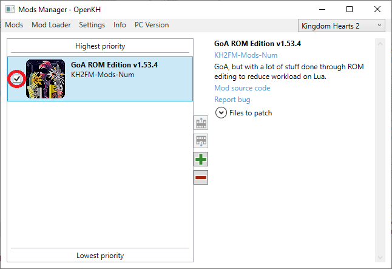

# PC New Setup Guide

Index:
* [Heads up!](#heads-up)
* [Downloads](#resources-needed)
* [Installing the Mod Manager & Seed Generator](#installing-openkh-mod-manager-and-seed-generator)
* [Setting up the Mod Manager](#how-to-setup-the-mod-manager)
* [Installing Lua Backend](#lua-backend-installation)
* [Installing the GoA mod](#garden-of-assemblage-mod-installation)
* [Installing a new seed](#installing-a-new-seed-to-play)
* [Stability Notes](#you-are-now-ready-to-play-the-kh2-randomizer)

## Heads up!
* Feel free to go to the [discord server](https://discord.gg/vKhdwNAmzE) for help with the setup, there is a dedicated #help channel where you can find people to assist you if you're facing any difficulties. (P.S. Please be polite)
* **You must run the game once** before you start the guide. Otherwise it may not boot up correctly after the randomizer is installed.
* **VERIFY GAME FILES** through the Epic Games Launcher for Kingdom Hearts 1.5 + 2.5 Remix (v1.0.0.8_WW), they need to be clean/unpatched files for the extraction process to work.
* If you have EVER installed the KH2 Randomizer before then please check your `C:\Documents\KINGDOM HEARTS HD 1.5+2.5 ReMIX\scripts\kh2 folder` (if you have one) and EMPTY IT.
* Unofficial copies of the game are not supported, it is strongly recommended you buy and install the game directly from the Epic Game Store.

## Resources Needed:
* [OpenKH Mod Manager](https://github.com/aliosgaming/OpenKh/releases/latest/download/OpenKH.Mod.Manager.zip)
* [Seed Generator](https://github.com/tommadness/KH2Randomizer/releases/latest/download/Kingdom.Hearts.II.Final.Mix.Randomizer.zip)
* [.NET6 Desktop Runtime](https://download.visualstudio.microsoft.com/download/pr/52d6ef78-d4ec-4713-9e01-eb8e77276381/e58f307cda1df61e930209b13ecb47a4/windowsdesktop-runtime-6.0.25-win-x64.exe
)

## Installing OpenKH Mod Manager and Seed Generator
1. Install .NET6 Runtime by running the `windowsdesktop-runtime-6.0.25-win-x64.exe` executable you just downloaded
2. Create a KH2 Rando folder on the same hard drive you have the game installed (__This **cannot** be under a Microsoft "OneDrive" directory and also should not be on an external hard drive__). This is where you will put all your randomizer tools
3. Extract OpenKH Mod Manager to this folder 
4. Extract the Seed Generator to its own folder as well (Be sure to extract ALL files from the zip)
	- It's recommended to give each app its own subfolder to make navigating their files easier (See screenshot)

## How to Setup The Mod Manager:
1. Run the **"OpenKh.Tools.ModsManager.exe"** in the OpenKH folder 
	- The Setup Wizard will open automatically, click **"Next"** to start
2. Change game edition to **"PC Release Via Epic Games Store"**
3. Then click the folder icon and navigate to your KH1.5_2.5 installation folder (The default is `C:\Program Files\Epic Games\KH_1.5_2.5` but this may differ from your own)
4. Once your game folder is chosen, click **"Next"**

5. Click the **"Install Panacea for Windows"** Button. This will install the mod loader to your game installation folder. Then click **"Next"**
	- If you want to verify it was added successfully, check your game's install folder for a file called `DBGHELP.DLL` and a folder called `Dependencies`

6. You will also need to install LuBackend to play the randomizer. Enable the **"KH2"** option for now and then click "Install and Configure Lua Backend"
	- You may re-run the setup wizard at any time to add support for the other games as well.
7. Once the LuaBackend install is complete click **"Next"**

8. OpenKH can launch KH2 from the mod manager itself by enabling the **"Launch Via Epic Games"** option. This option can save you time and a few clicks whenever you want to run the game after changing your mods or seed. It's recommended to enable this but is not required.

9. The mod manager now has the option to extract multiple games from the KH1.5_2.5 collection. For the purposes of this guide you only need to extract KH2, but feel free to extract the others as well if you plan on modding those games, or for including their music in the seed generators "music rando" option. Leave the extraction location as default, then press the **Extract Game Data** button to begin extraction. It usually takes 5-15 minutes (for KH2 alone) depending on your hardware so please be patient.

10. Once the extraction is complete, click on **Next** and on the next window click **Finish**. You have successfully installed the Mods Manager!

## Garden of Assemblage Mod Installation:
Installing new mods into the mods manager is easy! Follow these steps to get the main Garden of Assemblage mod installed:

1. Be sure the game selected in the top right of the main window shows **Kingdom Hearts 2**
2. Next, Click **"Mods"** in the top left drop down menu, and then click  **"Install a new mod"**

2. In the **"Add a new mod from Github"** section, type in the account name and mod name. This will download a mod from its hosted Github repo
	- Type **"KH2FM-Mods-Num/GoA-ROM-Edition"** into the text box and click on **"Install"** in the bottom right

3. To enable the mod, be sure to click the checkbox next to the newly added mod in the list

4. Then click **"Mod Loader"** and then **"Build and Run"** which will build your new mod and run the game for you automatically

* *Note: Newly enabled mods won't show up in game unless you **"Build"** or **"Build and Run"** after enabling them*

## Installing a new seed to play:
1. Choose your seed settings in the generator window and then click on **"Generate Seed"** in the bottom right.

*If you choose settings that may not act the same between the PCSX2 and PC version, the button will separate between PC and PCSX2, be sure to click the right one if it does so.*

2. This will open up a window to save the seed as a zip file. Save it anywhere that works for you (I like to place it in the same folder as the generator)
3. Once saved, open up the mod manager and click on **"Mods"**, then **"Install a New Mod"**
4. This time click on **"Select and Install Mod Archive or Lua Script"**, navigate to your new seed zip file and click **"Open"**

5. Be sure to click on the check box next to the seed, then click on **"Build"** and **"Build and Run"** to enable the mod in game. Note the 5 buttons to the right of the mod list. The First button places a mod at the top of the list. The second moves a mod up the list one space, the third moves it down the list by one space. The Green '+' icon is a shortcut to install a new mod, while the Red "-" icon is a shortcut to deleting a mod
	- **How to install a new seed in the future:** Create a new zip seed file using the generator. Delete the current seed from your Mods Manager. Add the new zip seed to your mods manager. Enable the seed and then **"Build and Run"**

### *Note: As you add more mods to the Mods Manager it is a general rule that the Seed goes at the **top** of the list and the GoA mod goes at the **bottom** unless a mods description says otherwise. If mods have files that overlap then the mods above will overwrite the files of those below in the list.*

*Editors note: I heavily recommend you install these two mods to help provide a better experience when playing rando -*

* **KH2FM-Mods-equations19/auto-save** - This mod auto saves the game for you as you enter rooms. Be sure to make at least 1 regular save in game, then if you ever crash or your game closes unexpectedly, just hold the **SELECT** button while loading a save, and the auto-save will be loaded instead.
* **KH2FM-Mods-equations19/soft-reset** - Hold **L1+L2+R1+R2+Start** at the same time to immediately reset the game to the start screen. Very useful if you accidentally softlock in boss/enemy rando, or just to restart the game faster!
* **[KH2 Rando Tracker](https://github.com/Dee-Ayy/KH2Tracker/releases/latest)** - Not an OpenKH mod but instead a full fledged automated tracker program for the Important Checks in game. Checkout [Hint Systems](https://kh2rando.com/hints) for info about different ways to play Rando!

You mod manager should look like this when you are done:

# *You are now ready to play the KH2 Randomizer!*

__Technical And Stability Notes__
1. As mentioned earlier in the guide, the Mod Manager/Lua doesn't seem to work if the folder is under a "OneDrive" directory. We don't know exactly why but it's a conistent thing between users. Be sure to move your folders and re-run the setup wizards if you installed in a "OneDrive" directory.
2.. Recommended to set fps limit to **60fps**.
3. Recommended to run game in windows/borderless windowed mode. Fullscreen is stable but the game can crash if you alt-tab out.
4. Overlays that hook onto the game process (Steam, RivaTuner, Nvidia Overlay, etc) and recording programs (Obs, Streamlabs, Xsplit) seem to decrease stability when playing rando. It's recommended to disable them, or in the case of recording programs use window/desktop capture, in order to minimize your chances of a crash.
5. GoA ROM and the Seed Generator will always be compatible with one another. Any other mods beyond that should be compatible as long as they don't overlap on changes. Mods at the top of the list will overwrite mods below them if there's any overlapping files. Feel free to ask in the [Community Discord](https://discord.gg/vKhdwNAmzE) if you aren't sure.
6. Boss/Enemy Rando is amazing but still a work in progress. Please report any bugs/softlocks/out-of-bounds glitches you encounter to the coresponding Google Form listed in the #bug-reports channels of our Discord. 
