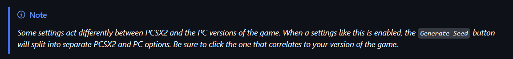
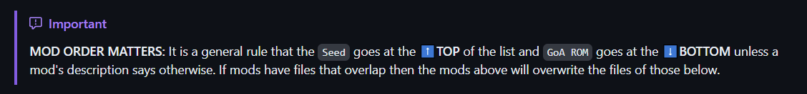

# PC - Steam and Epic Standalone Seed Generator Setup Guide

* [Downloads](#downloads)
* [Installing the Mods Manager & Seed Generator](#installing-openkh-mods-manager-and-seed-generator)
* [Setting up the Mods Manager](#setting-up-openkh-mods-manager)
* [Installing the GoA mod](#garden-of-assemblage-mod-installation)
* [Installing a new seed](#installing-a-new-seed-to-play)
* [Stability Notes](#you-are-now-ready-to-play-the-kh2-randomizer)

## Downloads:
* [Seed Generator](https://github.com/tommadness/KH2Randomizer/releases/latest/download/KH2.Randomizer.exe)
  - The program that generates KH2 Randomizer seeds. In the app you can see detailed descriptions about each setting by hovering over them with your mouse, or you can read more about them on the "Settings" page [here](https://tommadness.github.io/KH2Randomizer/settings/)

## Installing The Seed Generator
1. Start by downloading the Seed Generator program from the download links above

2. Place the `Seed Generator` exe into its own "Seed Generator" folder in the "KH2 Rando" folder. When we run the Seed Generator for the first time later in this guide, it will place a few new files and folders into its directory and we don't want to get them mixed up with our other stuff

## Installing a new seed to play:
1. Open the Seed Generator app by double clicking the `KH2.Randomizer.exe` program you downloaded earlier. If this is your first time starting the program, it may take some time to open as it extracts the necessary folders and files it uses to run.
2. Choose your seed settings in the generator window, or choose one of the built in presets under the `Preset` tab (I recommend the "StarterSettings" preset) and then click on `Generate Seed` in the bottom right

    

3. This will open up a window to save the seed as a zip file. Save it anywhere that works for you (I like to place it in the same folder as the generator)
4. Once saved, return to the Mods Manager and click on `Mods`, then `Install a New Mod`
5. This time click on `Select and Install Mod Archive or Lua Script`, navigate to your new seed zip file and click `Open`

    

    

 

7. Be sure to click on the check box next to the seed, then click on `Build` and `Build and Run` to enable the mod in game. Note the 5 buttons to the right of the mod list. The first button places a mod at the top of the list. The second moves a mod up the list one space, the third moves it down the list by one space. The green '+' icon is a shortcut to install a new mod, while the red "-" icon is a shortcut to deleting a mod
	- `How to install a new seed in the future:` Create a new zip seed file using the generator. Delete the current seed from your Mods Manager. Add the new zip seed to your Mods Manager. Enable the seed and then `Build and Run`

    

* `KH2FM-Mods-equations19/auto-save` - This mod auto saves the game for you as you enter rooms. Be sure to make at least 1 regular save in game, then if you ever crash or your game closes unexpectedly, just hold the `SELECT` button while loading a save, and the auto-save will be loaded instead.
* `KH2FM-Mods-equations19/soft-reset` - Hold `L1+L2+R1+R2+Start` at the same time to immediately reset the game to the start screen. Very useful if you accidentally softlock in boss/enemy rando, or just to restart the game faster!
* `KH2FM-Mods-equations19/KH2-Lua-Library` - _This mod is required to use either of auto-save or soft-reset_.
* [KH2 Rando Tracker](https://github.com/Dee-Ayy/KH2Tracker/releases/latest) - Not an OpenKH mod but instead a full fledged automated tracker program for the Important Checks in game. Checkout [Hint Systems](https://kh2rando.com/hints) for info about different ways to play Rando!

**You Mods Manager should look like this when you are done:**

# *You are now ready to play the KH2 Randomizer!*
Please use the #help channel in our [Community Discord](https://discord.gg/vKhdwNAmzE) if you have any errors or questions.

__Technical And Stability Notes__
1. GoA ROM and the Seed Generator will always be compatible with one another. Any other mods beyond that should be compatible as long as they don't overlap on changes. Mods at the top of the list will overwrite mods below them if there's any overlapping files. Feel free to ask in the [Community Discord](https://discord.gg/vKhdwNAmzE) if you aren't sure.
3. Boss/Enemy Rando is amazing but still a work in progress. Please report any bugs/softlocks/out-of-bounds glitches you encounter to the corresponding Google Form listed in the #bug-reports channels of our Discord. 
