# Migrating from Mods Manager Bridge to OpenKH Panacea

This guide helps you migrate from using Mods Manager Bridge (`build_from_mm`) to the OpenKH Panacea mod loader. This
guide is _not_ meant to be a first-time setup guide - it assumes you already have a working setup with Mods Manager and
Mods Manager Bridge, and that you're comfortable using them to patch your game.

### 1. Make sure your game files are back to a vanilla/unpatched state before migrating

You absolutely want to make sure you start from a fresh set of game files. There are two ways to accomplish this:

* Option 1: Verify your game in Epic Games Store. This is the most foolproof way to ensure your game files are
  unpatched.

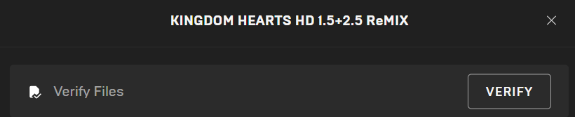

* Option 2: Use the `restore` option in Mods Manager Bridge to restore the backup packages it created automatically when
  you first patched. This option will be faster than verifying in Epic Games Store since the backup files are already on
  your PC.

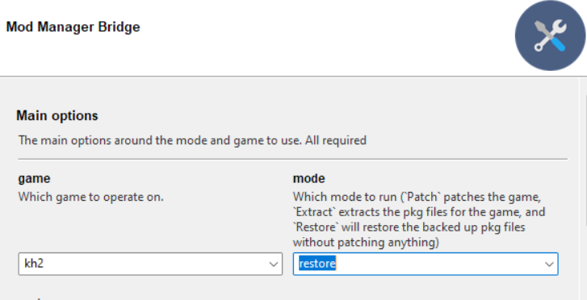

### 2. Prepare LuaBackend Hook

* (Many randomizer players use LuaBackend Hook, but if you use LuaFrontend rather than LuaBackend Hook, this step is not
  needed.)
* In order to get both Panacea and LuaBackend Hook working together, rename your existing `DBGHELP.dll` file
  to `LuaBackend.dll` before proceeding any further.

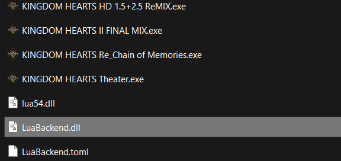

### 3. Install the latest version of the OpenKH tools

* Determine where you have the OpenKH tools installed on your PC. This is the folder that contains the Mods Manager
  program that you have already been using to add/remove mods.
* Download the latest version of the OpenKH tools (linked on the [Downloads](../../downloads/index.md) page).
  * Or click [HERE](https://cdn.discordapp.com/attachments/803658031749267517/1006967855633399838/openkh-modmanager.zip) for direct download
* Copy all files from the OpenKH tools zip file to your OpenKH tools location. When prompted to replace existing files,
  do so.
    * Alternatively, you could choose to copy all the files from the OpenKH tools zip file somewhere else to start fresh
      without affecting your existing OpenKH tools version.

### 4. Run the Mods Manager setup wizard

* Open Mods Manager. If you are starting fresh, the setup wizard will display. If not, choose `Settings -> Run wizard`.

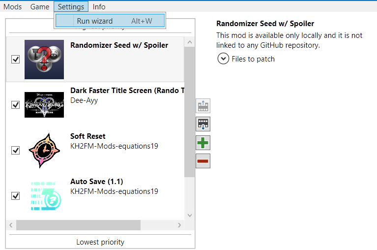

* On the `Game edition` screen, choose `PC Release via Epic Game Store` and browse to the folder containing the game
  executable files (for many setups `C:\Program Files\Epic Games\KH_1.5_2.5` but could be different for your PC).
  Choose `Next` to move on.

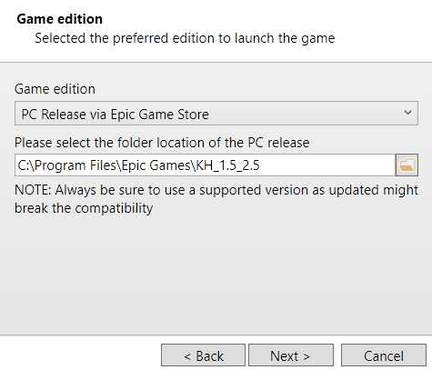

* On the `Install OpenKH Panacea` screen, choose to `Install OpenKH Panacea`. The wizard should inform you that Panacea
  is now installed (this should not take long). Choose `Next` to move on.

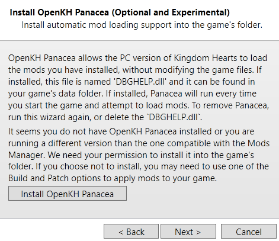 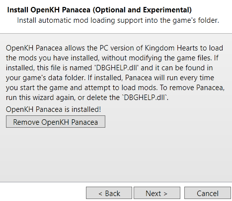

* On the next screen, leave `Bypass the launcher` unchecked and choose `Next` to move on. Bypassing the launcher is not
  recommended.

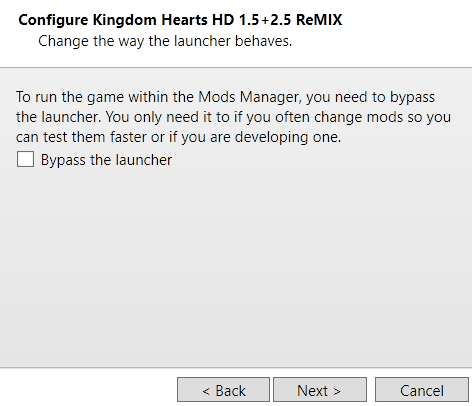

* For the `Set Game Data Location` screen's `Extraction folder location`, you can use one of two approaches:
    * Browse to the folder where you extracted your KH2 game data using Mods Manager Bridge originally. As long as
      you're confident your extracted game data was from vanilla game files, this option should be fine.
    * Alternatively, choose a desired location and choose `Extract game data` to start an extraction. This will take
      several minutes, depending on your PC.
    * Either way, once finished, choose `Next` to move on.

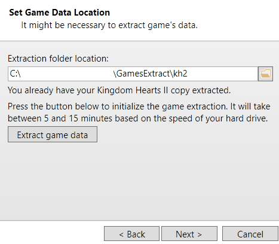

* Choose `Finish` to close the setup wizard and save your settings.

### 5. Use Mods Manager to configure mods

* Use Mods Manager to add/remove/check/uncheck mods as usual. (You may have fewer or more mods than shown here.)

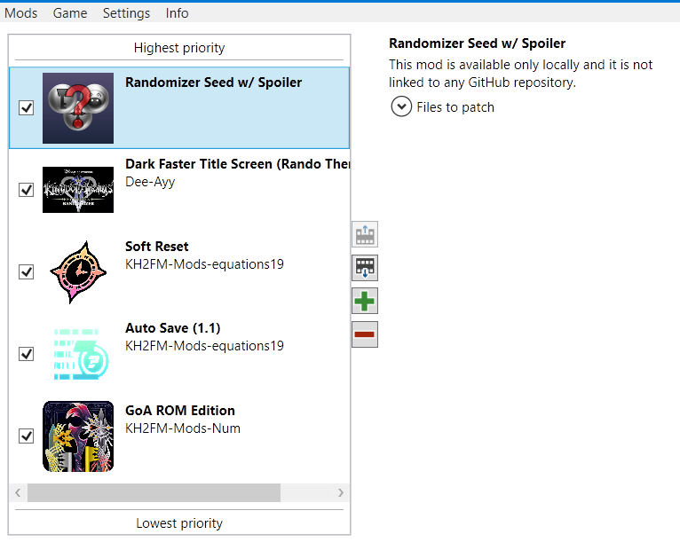

* Choose `Game -> Build -> Build Only` to prepare your mods.

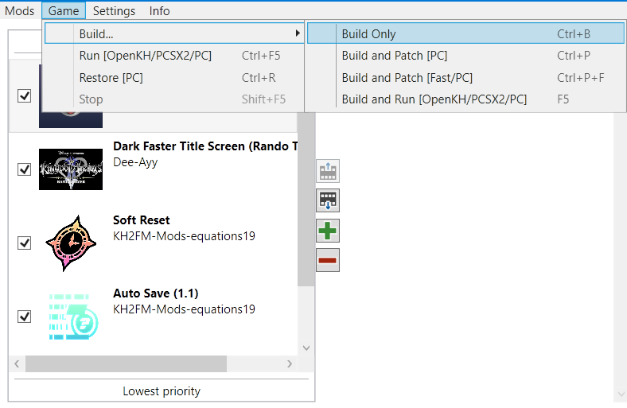

* A console window will come up while preparing mods and will disappear once finished. After this has finished, start
  your game normally and your chosen mods should be applied.

### 6. Preparing a new Randomizer Seed

* Works essentially the same as it did before, but without the additional patching step. Remove the previous randomizer
  seed from Mods Manager, add the new seed, and then Build Only again. The next time you start the game, the new seed
  will get loaded.

### 7. Removing Panacea (if desired)

* Once Panacea is installed, it will run every time you start the game and will attempt to load any mods that are built.
  To remove Panacea, you can run the setup wizard again and there is an option to `Remove OpenKH Panacea`.

* If you still want to use LuaBackend Hook, rename `LuaBackend.dll` back to `DBGHELP.dll` after Panacea is gone.
