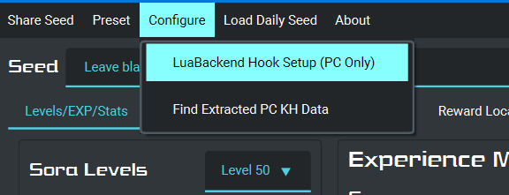
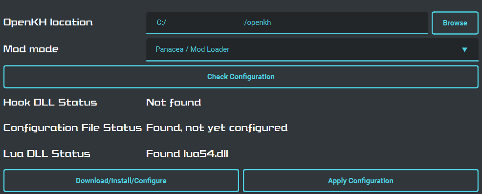
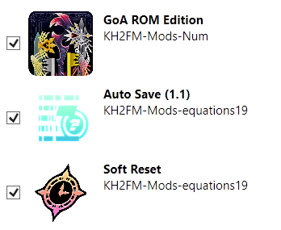

# Migrating from Mods Manager Bridge to OpenKH Mods Manager Patching

This guide helps you migrate from using Mods Manager Bridge (`build_from_mm`) to patching your game using OpenKH Mods
Manager itself. This guide is _not_ meant to be a first-time setup guide - it assumes you already have a working setup
with Mods Manager and Mods Manager Bridge, and that you're comfortable using them to patch your game.

### 1. Make sure your game files are back to a vanilla/unpatched state before migrating

You absolutely want to make sure you start from a fresh set of game files. There are two ways to accomplish this:

* Option 1: Verify your game in Epic Games Store. This is the most foolproof way to ensure your game files are
  unpatched.

* Option 2: Use the `restore` option in Mods Manager Bridge to restore the backup packages it created automatically when
  you first patched. This option will be faster than verifying in Epic Games Store since the backup files are already on
  your PC.

* Go to your game installation folder and delete the **DBGHELP.dll, Luabackend.toml, and Lua54.dll files** before continuing as well.

### 2. Install the latest version of the OpenKH tools

* Determine where you have the OpenKH tools installed on your PC. This is the folder that contains the Mods Manager
  program that you have already been using to add/remove mods.
* Download the latest version of the OpenKH tools (linked on the [Downloads](../../downloads/index.md) page).
* Copy all files from the OpenKH tools zip file to your OpenKH tools location. When prompted to replace existing files,
  do so.
    * Alternatively, you could choose to copy all the files from the OpenKH tools zip file somewhere else to start fresh
      without affecting your existing OpenKH tools version.

### 3. Run the Mods Manager setup wizard

* Open Mods Manager. The setup-wizard should automatically open first after updating your files. If not please choose `Settings -> Run Wizard`.

* On the `Game edition` screen, choose `PC Release via Epic Game Store` and browse to the folder containing the game
  executable files (for many setups `C:\Program Files\Epic Games\KH_1.5_2.5` but could be different for your PC).
  Choose `Next` to move on.

* On the `Install OpenKH Panacea` screen, just choose `Next` without installing as we'll be patching our game files
  rather than using OpenKH Panacea.

* On the next screen, leave the `Launch via Epic Games` option **unchecked**. This option cannot be enabled for the patching setup as it requires the Panacea Mod Loader to work.

* For the `Set Game Data Location` screen's `Extraction folder location`, you can use one of two approaches:
    * Browse to the folder where you extracted your KH2 game data using Mods Manager Bridge originally. As long as
      you're confident your extracted game data was from vanilla game files, this option should be fine.
    * Alternatively, choose a desired location and choose `Extract game data` to start an extraction. This will take
      several minutes, depending on your PC.
    * Either way, once finished, choose `Next` to move on.

* Choose `Finish` to close the setup wizard and save your settings.

### 4. Configure LuaBackend Hook for Mods Manager integration

Download the latest version of the Seed Generator [HERE](https://github.com/tommadness/KH2Randomizer/releases/latest/download/Kingdom.Hearts.II.Final.Mix.Randomizer.zip)

Version 2.1.5 and above of the seed generator adds a screen to help you configure LuaBackend Hook automatically.

* Open the seed generator and choose `Configure -> LuaBackend Hook Setup (PC Only)`.

* On the LuaBackend Hook Setup screen, browse to the location where your OpenKH tools (such as Mods Manager) are
  located, and choose your intended Mod mode. This choice affects the name of the LuaBackend Hook DLL file.
  * Choose `Panacea (Mod Loader)` if you intend to use OpenKH Panacea to load mods without patching game files. Panacea
    uses `DBGHELP.dll` to hook into the game, and it knows to look for LuaBackend Hook's file with the name
    `LuaBackend.dll`.
  * Choose `Patch / Fast Patch` if you intend to patch your game files. In this configuration, LuaBackend Hook is named
    `DBGHELP.dll` itself.
* Choose `Check Configuration`.

* If you already have LuaBackend Hook installed, the files will all be found, but `Configuration File Status` may report
  that LuaBackend Hook is not yet configured for Mods Manager integration. If this is the case, you can just choose
  `Apply Configuration` to apply the necessary configuration.
* If any of the files are missing, or if you just want a fresh copy, choose `Download/Install/Configure` which will
  download, install, and configure a compatible version of LuaBackend Hook.

After you've configured LuaBackend Hook for Mods Manager integration, you can now take advantage of several common mods
with bundled scripts.

* Remove GoA ROM, auto save, and soft reset Lua scripts (if they exist) from your
  `Documents\KINGDOM HEARTS HD 1.5+2.5 ReMIX\scripts\kh2` folder. We'll manage these scripts via Mods Manager now. If
  you have other Lua scripts in this folder, you can still manage those manually. We just don't want duplicates.
* Make sure GoA ROM Edition is up-to-date in Mods Manager. GoA ROM bundles its Lua script in recent versions.
* Install `KH2FM-Mods-equations19/auto-save` and `KH2FM-Mods-equations19/soft-reset` in Mods Manager. The order for
  these two mods doesn't matter.

### 5. Use Mods Manager to configure mods

* Use Mods Manager to add/remove/check/uncheck mods as usual. (You may have fewer or more mods than shown here.)

* You may notice that your old `Game` tab in the top left has been renamed to `PC`. This is where you can `Patch` or `Fast Patch` your game now. 
    * If you've been using `fast_patch` all along in Mods Manager Bridge, the `Fast` option works mostly the same. If
      you've needed to use the full `patch` option in Mods Manager Bridge, then you probably want to avoid the `Fast`
      option here as well.

* A console window will come up while patching and will disappear once finished. After the patching has finished, start
  your game normally and your chosen mods should be applied.

### 6. Patching a new Randomizer Seed

* Works essentially the same as it did before. Remove the previous randomizer seed from Mods Manager, add the new seed,
  and then Build and Patch again.

### 7. Restoring original files (if desired)

* The first time you patch within Mods Manager, backups of your original game packages will be made, so the first patch
  will take longer than subsequent patches. Choose `Game -> Restore` if you ever want to restore your game files to
  their original state from these backups.

### What happens to my old KH2PCPATCH files?

The new update to the mod manager allows it to load in kh2pcpatch files as if they were regular mods. Just add your kh2pcpatch files the same way you would add a zip seed and the mod manager will handle everything for you.
