# KH2FM Randomizer (PS2) Setup using PCSX2-EX

This guide will help you set up Randomizer Mod for the PCSX2-EX (PS2 Emulator) version of KINGDOM HEARTS II FINAL MIX.

---

## Step 0: Prep work ##

To set up Rando, Extract, Download and/or Install the following:
- OpenKH
    - OpenKH Pre-requisite: .NET Desktop Runtime 6
- A copy of KINGDOM HEARTS II FINAL MIX+, ripped in an ISO format.
- [PCSX2-EX](https://cdn.discordapp.com/attachments/712837252279173153/974389136540713030/PCSX2-EX.v3.10.0.7z) (edit the downloaded archive: remove the “, attachment” bit on the extension file)
    - PCSX2-EX Pre-requisite: PCSX2 BIOS files
- KINGDOM HEARTS II FINAL MIX Randomizer Seed Generator
- [Special PNACH](https://discord.com/channels/712837252279173150/811885954754412545/893022782533816350) to mitigate gameplay-related problems caused by setting the game to the English region (X to attack/confirm, O to jump/cancel). Disregard this if you want to play with JP controls (X to jump/cancel, O to attack/confirm)

All of these can be found on the Downloads section of the KINGDOM HEARTS II FINAL MIX Randomizer website.

I prefer to have them saved in a single folder (for this guide, I’ll be placing them in `C:\KH2FMRando-PS2` folder in my computer for simplicity reasons).

---

## Step 1: PCSX2-EX Setup ##
PCSX2-EX looks and works similarly to vanilla PCSX2, except from some changes like having a LUA engine for LUA-based mods, among others. With that in mind, PCSX2-EX’s setup is pretty much like vanilla PCSX2’s setup as well, so it should be simple enough that I won’t include it on this guide. Use this time to set up your controllers, graphics settings, memory cards, etc.

Although, for the Randomizer to work, Cheats and LuaEngine are required to be enabled, so don’t forget to enable that. It’s under `System > Enable LuaEngine` and `System > Enable Cheats` under the main PCSX2-EX Window.

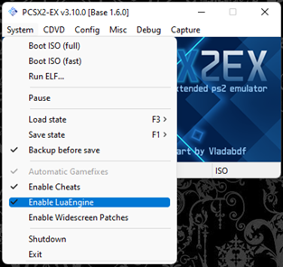 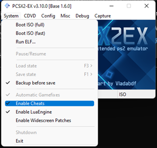

Afterwards, close up PCSX2-EX, this is the last time that we’ll be opening it manually, as the rest of the setup process will make it so that PCSX2-EX will open automatically.

If you will be playing on the English region (X to attack/confirm, O to jump/cancel), copy the `.pnach` file that you downloaded earlier to the cheats folder that was automatically created by the PCSX2-EX setup, located at `Documents/PCSX2`. If you will be playing on the Japanese region (X to jump/cancel, O to attack/confirm), you can skip this step.

TL;DR, its:
1.	Set up PCSX2-EX just like you would set up PCSX2.
2.	`Enable Cheats` and `Enable LuaEngine` 
3.	Close PCSX2-EX.
4. [Optional] Copy the English Region specific .pnach fix

---

## Step 2: OpenKH Mods Manager Setup ##

Download and extract the OpenKH archive (downloading the latest version) into a place you would be most comfortable with. (for this guide, its going to be `C:\KH2FMRando-PS2\OpenKH`) and look for the `OpenKH.Tools.ModsManager.exe` file. We will be configuring and running the Randomizer via the Mods Manager, so it would be wise to make a shortcut of this in your Desktop so that you won’t have to dive in the folder every time you want to play the Randomizer.

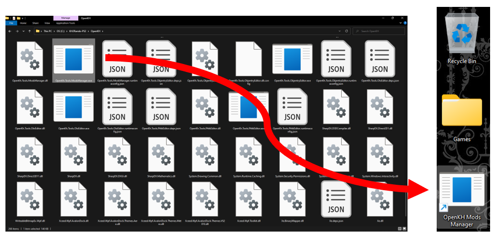

Opening the OpenKH Mods Manager, you will be greeted with the first time set up. To save everyone the trouble of reading text, I have converted this process into a GIF!

But if you have difficulty following this GIF, here’s the steps in condensed format:
1.	Click `Next`.
2.	Under `Game Edition`, select `PlayStation 2 using PCSX2 Emulator`. Then, point the file selection prompt to the PCSX2-EX executable (for this guide, its in `C:\KH2FMRando-PS2\PCSX2-EX.v3.10.0`). Then click `Next`.
3.	You will now be prompted to load up your KINGDOM HEARTS II FINAL MIX ISO file. Point the program towards that ISO file (for this guide, its in `C:\KH2FMRando-PS2\<filename of KH2FM ISO>.iso`). Click `Next`.
4.	Click on `Extract game data`. This will take a few minutes depending on the medium of your storage device. Click `Next`.
5.	Select the region. If you're playing with English controls, select `English (text US, menu US, voice US)`; or `Use game default region` if you're playing with JP controls. Click `Next`.
6.	Click `Finish`.

From here on out, we’re now going to get the OpenKH mods needed for this mod. Click on the green + icon on the middle of the screen, and in the Add a new mod from Github text space, type on `Rikysonic/languagepack-en`, then click Install. This will translate our KINGDOM HEARTS II FINAL MIX ISO file from Japanese to English in real time. If you are playing in a different language, replace this mod with the appropriate language mod.

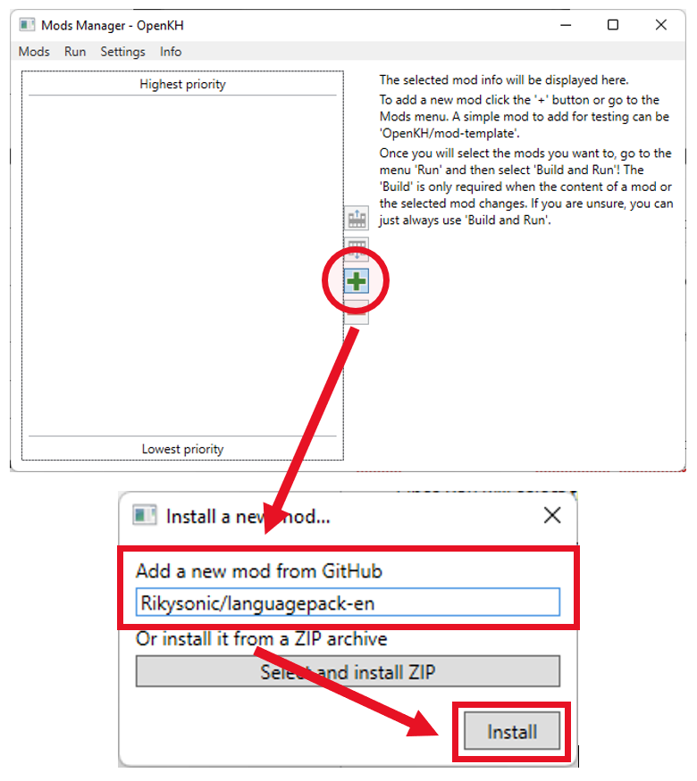

Once that’s done, click the green + icon to add a mod again, but this time, type in `KH2FM-Mods-Num/GOA-ROM-Edition` 

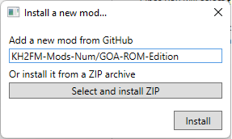

Once you have downloaded `KH2FM-Mods-Num/GOA-ROM-Edition`, click on the mod, go to `Mods`, then select `Open mod folder` (Keyboard shortcut: `Ctrl+O`). From here, copy the `F266B00B GoA ROM.lua` file to `scripts` folder (that was automatically created during the PCSX2-EX setup in Part 1) located in your `Documents/PCSX2` folder.

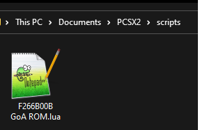

Also, delete the `mod.yml` file (or rename it to something different like `mod_pc.yml`), then rename the `mod_ps2.yml` file to `mod.yml`. What we essentially did was change the mod from being configured for the Epic Games Store version of KINGDOM HEARTS II FINAL MIX, to the PCSX2 version of the game.

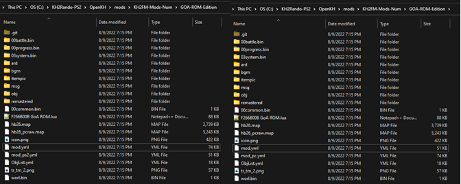

Before (left) and After (right)

---

## PART 3: THIS IS WHAT MAKES THINGS GO RANDO ##

All this time, we have only been setting up the Garden of Assemblage mod in its entirety, but now… we get to the actual Randomizer portion of the setup. 

Open the KH2FM Randomizer Seed Generator executable file (for this guide, its `C:\KH2FMRando-PS2\SeedGenerator`). Feel free to set up a desktop shortcut of this if you want to as well.

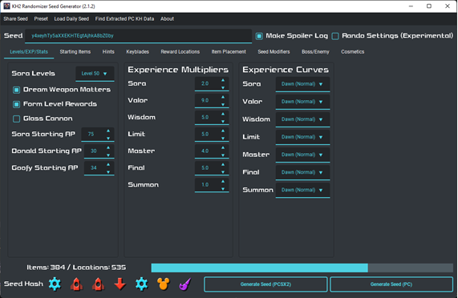

On the Seed Generator Window, it’s time to create a seed. There are way too many things to tweak around in making a seed that I might’ve made a novel if I enumerated it all here one-by-one. To check what each setting does, hover your mouse on that area and read the tooltip that shows up.

Once you have created your flavor of a rando seed, its time to make the seed. Click on `Generate Seed (PCSX2/PC)` (or `Generate Seed (PCSX2)` if you have enabled a setting that splits the Generate Seed button for PC and PCSX2) and save the zip file that it generates on the folder of your choice (for this guide, I have saved it to `C:\KH2FMRando-PS2`).

Then, open the OpenKH Mods Manager program, click the green + icon, but instead of typing up a mod, click on `Select and install ZIP`. From there, point it to the zip file that the Seed Generator has created.

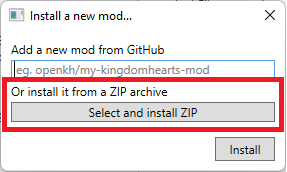

From here, you should have three mods installed: the Language pack of your choice, the Garden of Assemblage ROM Edition, and the Randomizer seed itself, arranged by mod priority from bottom to top. Don’t forget the enable the mod by checking the teeny tiny check box next to the gargantuan icon of the mod.

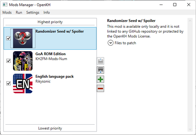

From here, click on `Run` in the menu, then select `Build and Run`. Alternatively, just press `F5` on your keyboard. This will build up the mods, open PCSX2-EX automatically with KINGDOM HEARTS II FINAL MIX booting up, and injecting the mods loaded in OpenKH Mods Manager into the game in real time.

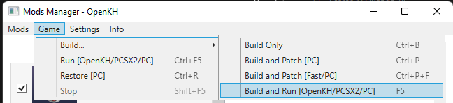

All that’s left now is to start the game and play KINGDOM HEARTS II FINAL MIX… now Randomized!

---

## ONE THING TO NOTE… ##

Should there be an update to any of the mods that you have installed, please update them. OpenKH Mods Manager will notify you if a mod has an update.

Specific to `KH2FM-Mods-Num/GOA-ROM-Edition`, you need to re-do the steps involving the .lua and the .yml file every time the mod has an update to avoid complications.

---

## Common FAQs: ##
**Okay, I’m done playing and I want to start another seed, what do?**

Just repeat Part 3 of this guide! That’s all you need to re-make a seed and play again. If you have created a shortcut of the OpenKH Mods Manager and the Seed Generator in your desktop, you can trim the re-run instructions to:

1.	Open Seed Generator
2.	Create New Seed
3.	Open OpenKH Mods Manager
4.	Delete Old Seed
5.	Install New Seed
6.	Enable New Seed
7.	Press `F5`.

**What if I have other mods?**

If you have any other mods to install, you may install them via the same installation method used above. However, keep in mind that some mods need to be arranged specifically in the Mods Manager menu (hint, you can move mod prioritization by clicking on the mod and pressing `Alt-Up` or `Alt-Down` keys). For Randomizer, the generated Randomizer seed HAS TO BE THE LAST THING TO BE MODDED, so it needs to be the one on top.

**I think I messed up, where can I find help?**

You can find help by asking in the [KH2FM Randomizer Discord](https://discord.com/invite/KH2FMRando)!
