# KH2FM Randomizer (PS2) Setup using PCSX2-EX

This guide will help you set up Randomizer Mod for the PCSX2-EX (PS2 Emulator) version of KINGDOM HEARTS II FINAL MIX.

---

## Step 0: Prep work ##

To set up Rando, Extract, Download and/or Install the following:

- [Custom Build of OpenKH Mod Manager](https://github.com/aliosgaming/OpenKh/releases/latest/download/OpenKH.Mod.Manager.zip)
    - OpenKH Pre-requisite: [.NET Desktop Runtime 6](https://download.visualstudio.microsoft.com/download/pr/52d6ef78-d4ec-4713-9e01-eb8e77276381/e58f307cda1df61e930209b13ecb47a4/windowsdesktop-runtime-6.0.25-win-x64.exe)
- A copy of KINGDOM HEARTS II FINAL MIX+, ripped in an ISO format. (will not be provided here for legal reasons)
- [PCSX2-EX](https://cdn.discordapp.com/attachments/803658031749267517/1066421486652497950/PCSX2-EX.v3.10.0.zip) (edit the downloaded archive: remove the “, attachment” bit on the extension file)
    - PCSX2-EX Pre-requisite: PCSX2 BIOS files (will not be provided here for legal reasons)
- [KINGDOM HEARTS II FINAL MIX Randomizer Seed Generator](https://github.com/tommadness/KH2Randomizer/releases)
- [Special PNACH](https://cdn.discordapp.com/attachments/738526266256392323/1134568809156595793/F266B00B_X-O_Swap.pnach) Swaps controls from JP to EN (X to Confirm and O to Jump)

I prefer to have them saved in a single folder (for this guide, I’ll be placing them in the `C:\KH2FMRando-PS2` folder on my computer for simplicity reasons).

__Do not install PCSX2 or the Mod Manager under a Microsoft "OneDrive" directory or an external hard drive. Mods won't load correctly and lua scripts will fail if you do.__

---

## Step 1: PCSX2-EX Setup ##
PCSX2-EX looks and works similarly to vanilla PCSX2, with the added support of LUA Engine and LUA-based mods. With that in mind, PCSX2-EX’s settings and menus should look familiar if you have ever used the original before. Use this time to set up your controllers, graphics settings, memory cards, etc.

Although, for the Randomizer to work, the **Cheats and LuaEngine settings must be enabled**, so don’t forget to turn them on. They're under `System > Enable LuaEngine` and `System > Enable Cheats` under the main PCSX2-EX Window.

 

Afterwards, close up PCSX2-EX

Copy the `F266B00B_X-O_Swap.pnach` file that you downloaded earlier to the cheats folder that was automatically created during the PCSX2-EX installation, located at `C:\Users\(Username)\Documents\PCSX2\cheats`. If you will be playing with the Japanese controls (X to jump/cancel, O to attack/confirm), you can skip this step.

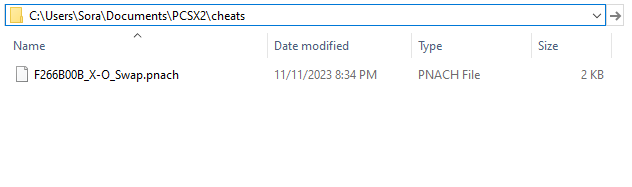

TL;DR, its:
1.	Set up PCSX2-EX just like you would set up PCSX2.
2.	`Enable Cheats` and `Enable LuaEngine` 
3.	Close PCSX2-EX.
4. Copy the X-O Swap Pnach to Cheats folder if using English Controls.

---

## Step 2: OpenKH Mods Manager Setup ##

Download and extract the latest OpenKH release into a place you would be most comfortable with. (For this guide, its going to be `C:\KH2FMRando-PS2\OpenKH`) and look for the `OpenKH.Tools.ModsManager.exe` file. We will be configuring and running the Randomizer via the Mods Manager, so it would be wise to make a shortcut of this on your Desktop so that you won’t have to dive in the folder every time you want to play the Randomizer.

When running the Mod Manager for the first time you will be greeted with the setup wizard. It is fairly straightforward but the steps with images are provided down below:

1.	At the welcome screen click `Next`.

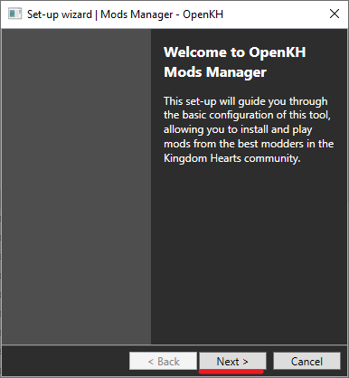

2.	Under `Game Edition`, select `PlayStation 2 using PCSX2 Emulator`. Then, point the file selection prompt to the PCSX2-EX executable. Then click `Next`.

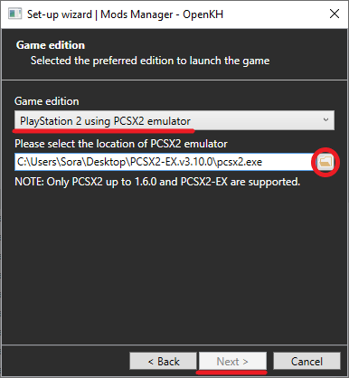

3.	You will now be prompted to load up your KINGDOM HEARTS II FINAL MIX ISO file. Point the program towards that ISO file (for this guide, its in `C:\KH2FMRando-PS2\<filename of KH2FM ISO>.iso`). Click `Next`.

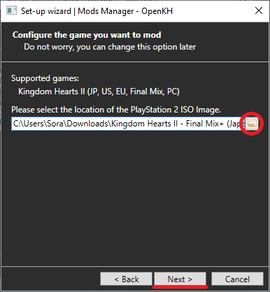

4.	Click on `Extract game data`. This will take a few minutes depending on the medium of your storage device. Click `Next`. **PLEASE SEE:**[How to verify my ISO is clean](#How-To-Verify-A-Clean-ISO) **BEFORE EXTRACTING**

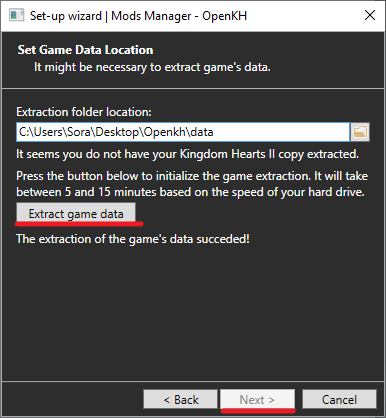

5.	Leave the Region Selection as `Default`. Click `Next`.

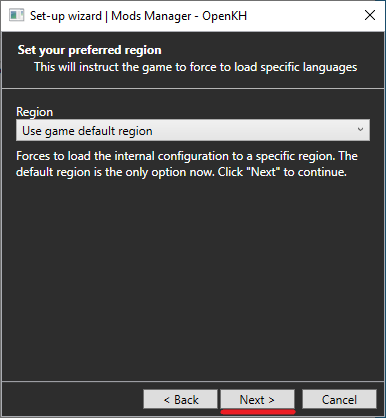

6.	Click `Finish`.

From here on out, we’re now going to get the OpenKH mods needed for this the rando. Click on the green + icon on the middle of the screen (Or click the "Mods" tab and then "Install New Mod"), and in the **Add a new mod from Github** text space, type on `Rikysonic/languagepack-en`, then click Install. This will translate our KINGDOM HEARTS II FINAL MIX ISO file from Japanese to English in real time. If you are playing in a different language, replace this mod with the appropriate language mod.

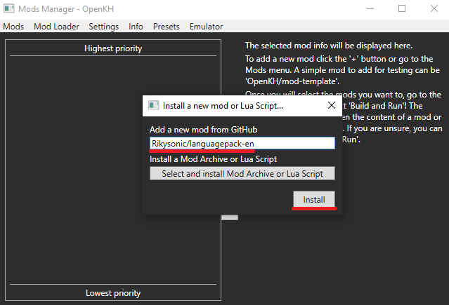

Once that’s done, click the green + icon to add a mod again, but this time, type in `KH2FM-Mods-Num/GOA-ROM-Edition` 

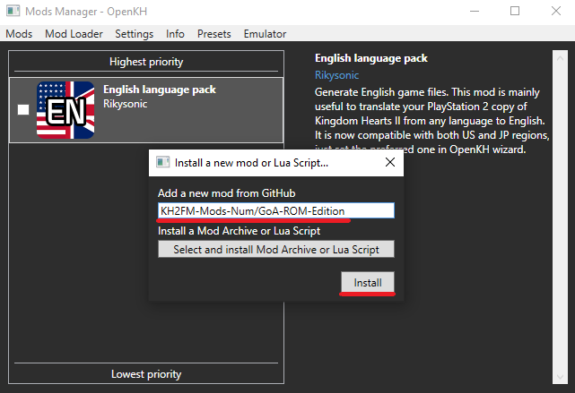

Once you have downloaded `KH2FM-Mods-Num/GOA-ROM-Edition`, click on the mod, go to `Mods`, then select `Open mod folder` (Keyboard shortcut: `Ctrl+O`). 

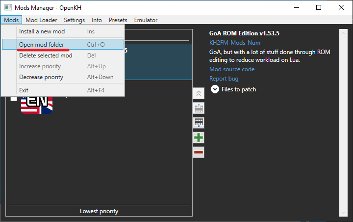

From here, copy the `F266B00B GoA ROM.lua` file to `scripts` folder (that was automatically created during the PCSX2-EX setup in Part 1) located in your `Documents/PCSX2` folder.

---

## Step 3: Seed Generator Setup ##

All this time, we have only been setting up the Garden of Assemblage mod in its entirety, but now… we get to the actual Randomizer portion of the setup. 

Open the KH2FM Randomizer Seed Generator executable file (for this guide, its `C:\KH2FMRando-PS2\SeedGenerator`). Feel free to set up a desktop shortcut of this if you want to as well.

On the Seed Generator Window, it’s time to create a seed. There are way too many things to tweak around in making a seed that I might’ve made a novel if I enumerated it all here one-by-one, so [here's](../../seed-generator/index.md) the round-up of all the seed generator's features. Otherwise, to check what each setting does, hover your mouse on that area and read the tooltip that shows up.

Once you have created your flavor of a rando seed, its time to make the seed. Click on `Generate Seed (PCSX2/PC)` (or `Generate Seed (PCSX2)` if you have enabled a setting that splits the Generate Seed button for PC and PCSX2) and save the zip file that it generates on the folder of your choice (for this guide, I have saved it to `C:\KH2FMRando-PS2`).

Then, open the OpenKH Mods Manager program, click the green + icon, but instead of typing up a mod, click on `Select and install Mod Archive or Lua Script`. From there, point it to the zip file that the Seed Generator has created.

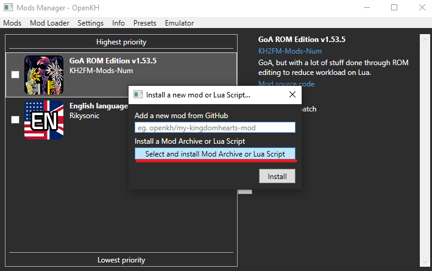

From here, you should have three mods installed: the Language pack of your choice, the Garden of Assemblage ROM Edition, and the Randomizer seed itself, arranged by mod priority from bottom to top. Don’t forget the enable the mod by checking the teeny tiny check box next to the gargantuan icon of the mod.

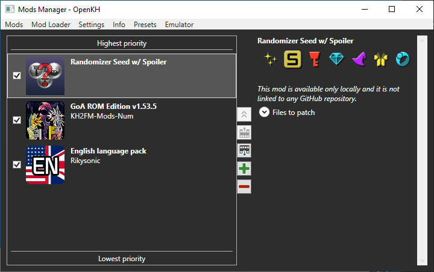

From here, click on `Mod Loader` in the menu, then select `Build and Run` (Keyboard shortcut: `F5`). This will build the mods, automatically open PCSX2-EX with KINGDOM HEARTS II FINAL MIX, and will inject the mods loaded in OpenKH Mods Manager into the game in real time.

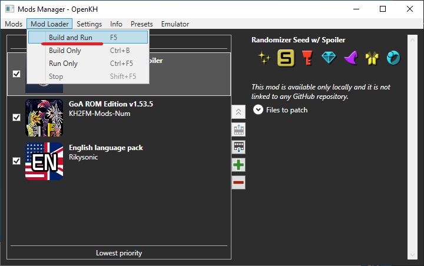

All that’s left now is to start the game and play KINGDOM HEARTS II FINAL MIX… now Randomized!

---

## ONE THING TO NOTE… ##

Should there be an update to any of the mods that you have installed, please update them. OpenKH Mods Manager will notify you if a mod has an update.

Specific to `KH2FM-Mods-Num/GOA-ROM-Edition`, you need to re-do the steps involving the .lua and the .yml file (last two procedures of Step 2) every time the mod has an update to avoid complications.

---

## Common FAQs: ##
**Okay, I’m done playing and I want to start another seed, what do?**

Just repeat Part 3 of this guide! That’s all you need to re-make a seed and play again. If you have created a shortcut of the OpenKH Mods Manager and the Seed Generator in your desktop, you can trim the re-run instructions to:

1.	Open Seed Generator
2.	Create New Seed
3.	Open OpenKH Mods Manager
4.	Delete Old Seed
5.	Install New Seed
6.	Enable New Seed
7.	Press `F5`.

**What if I have other mods?**

If you have any other mods to install, you may install them via the same installation method used above. However, keep in mind that some mods need to be arranged specifically in the Mods Manager menu (hint, you can move mod prioritization by clicking on the mod and pressing `Alt-Up` or `Alt-Down` keys). For Randomizer, the generated Randomizer seed HAS TO BE THE LAST THING TO BE MODDED, so it needs to be the one on top.

**I think I messed up, where can I find help?**

You can find help by asking in the [KH2FM Randomizer Discord](https://discord.com/invite/KH2FMRando)!

## How To Verify A Clean ISO:

Follow these steps to verify you have a clean ISO that's ready for the randomizer:

1. Open PCSX2-EX go to the **"Misc"** tab and click **"Show Console"**

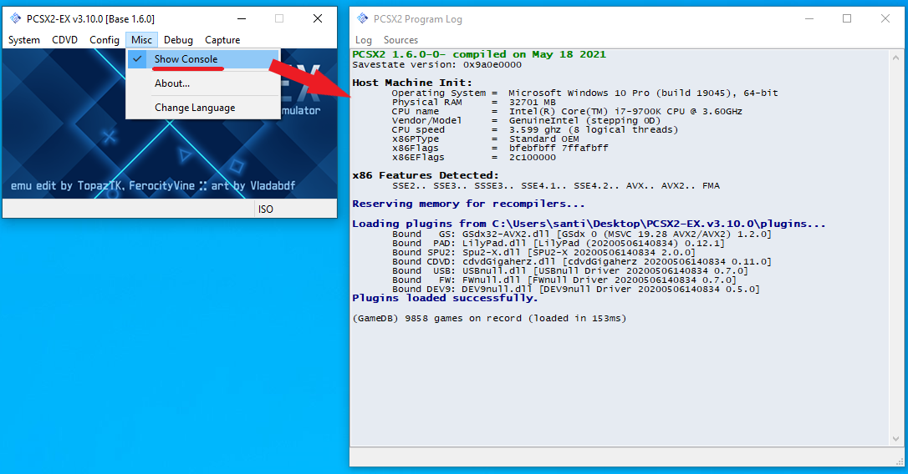

2. Then go to the **"CDVD"** tab -> **"ISO Selector"** -> **"Browse"** and select your KH2FM ISO

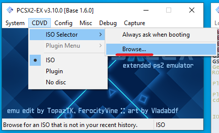

3. After an ISO has been selected, go to the **"System"** tab and click **"Boot ISO (fast)"**. The ISO will boot and you should see the PCSX2 Log start to output.

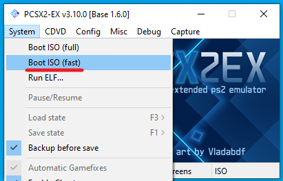

4. Once the log stops updating either expand the window vertically or scroll up until you see black text that says **"GSDx Lookup CRC:"**. The correct ID for your game will show up as **"F266B00B"** (See the below example). If any other ID shows up on this line you either have a pre-patched ISO or it is corrupted and you will need to get a clean one. 

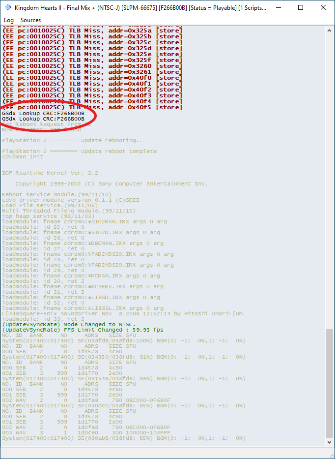

You may now close out of PCSX2-EX. You can return to the extraction portion of the guide by clicking [HERE](#Step-2:-OpenKH-Mods-Manager-Setup)