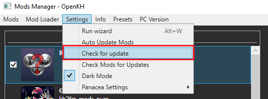
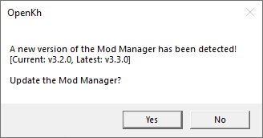
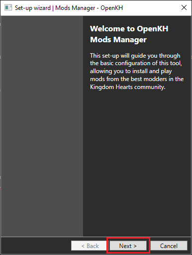
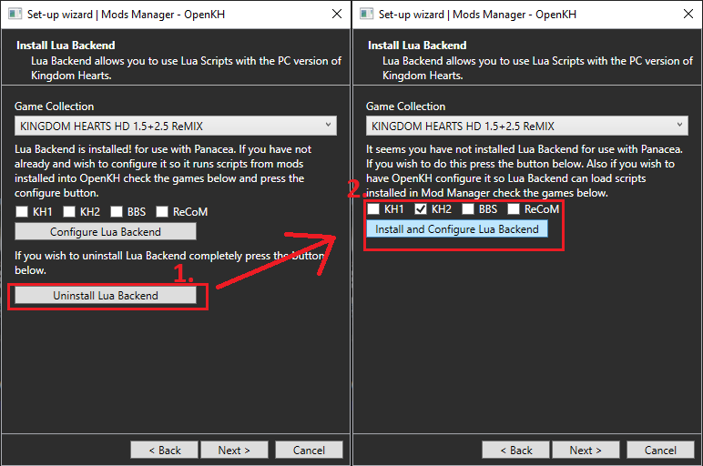
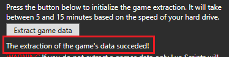
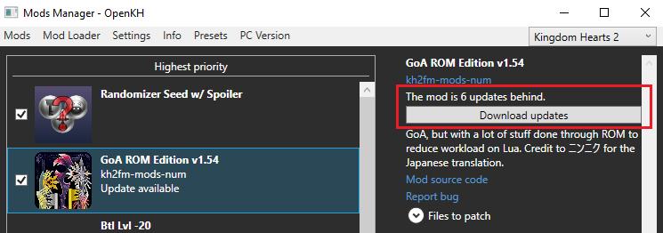

# Updating your KH2 Randomizer installation for the Epic Games Store release v1.0.0.9_ww
Here is a summary of the steps needed to update your KH2 Randomizer installation for the latest game version on Epic:
* Update the `Mods Manager`
* Run the new `Setup Wizard`
* Install the latest version of `Panacea`
* Uninstall and then reinstall the latest version of `LuaBackend`
* (Optional but recommended) `Re-extract game files` again, overwriting your current extraction
* Update `GoA ROM` to 1.54.1

Most of these steps are built into the guided `Setup Wizard`, however there are some changes from the previous update.

**For a smooth update process we recommend you follow the detailed guide down below:**

## Step 1: Updating the Mods Manager
1. Open the Mods Manager and click on the `Settings` tab. Then click on the `Check for Update` button in the drop-down menu

2. A popup should appear that informs you an update is available. Click `Yes` to begin the update

3. The Mods Manager will close, the new update will be downloaded and applied over your current installation, and when it is complete, the Mods Manager Setup Wizard should open automatically
   * If the `Setup Wizard` does *not* open automatically, then open up the `Mods Manager` manually and immediately run the `Setup Wizard` found under the `Settings` tab

## Step 2: Completing the New Setup Wizard (including the Panacea & LuaBackend Updates)

1. From the `Welcome Page` click `Next` to enter the `Game Edition Page`

2. There are 3 things on the `Game Edition Page` that you must do, see the below screenshot for an example:
   * Set the `Game Edition` drop-down to `PC Release`
   * Set the `Launcher` option below that to `Epic Games Store`
   * Verify that the `folder location` of the PC release is correct. If your game folder location is not already filled, or you are unsure if they are correct, you can click the `Detect Installations` button to automatically locate them

3. When you are done on the `Game Edition Page`, click `Next` to go to the `Install OpenKH Panacea` page

4. On the `Install OpenKH Panacea` page, verify the Game Collection drop-down is set to `KINGDOM HEARTS HD 1.5+2.5 ReMIX` and then click `Install Panacea for Windows`

5. Once `Panacea` is installed, click `Next` to continue to the `Install LuaBackend` page

6. On the `LuaBackend` page, first verify that the `Game Collection` drop-down is set to `KINGDOM HEARTS HD 1.5+2.5 ReMIX`

7. Now click on `Uninstall LuaBackend` to remove your old LuaBackend version

8. Then make sure the `KH2` option is checked and click `Install and Configure LuaBackend`

9. Once `LuaBackend` is installed, click `Next` to continue to the `Game Extraction` page

## Step 3: Extracting Game Files Again (Recommended, but technically optional*)
*Note: When Square released KH2 on steam, they chose to upscale many of the ingame textures. The update to the Epic Games Store version of KH2 included these upscaled textures. Due to the increased file size, the `disk space used by the game has nearly doubled`. The KH1.5+2.5 package now takes up around 70GB of space on its own, with the KH2 extraction requiring an additional 43GB on top of it. If you are limited on hard drive space and choose not to extract again (replacing your current extracted files) then the game *should* still work. You may however encounter some visual bugs and some 2D facial animations may be incorrect or just not play at all.*

0.5 If you *don't* want to extract the upscaled textures just click `Next` on this window to complete the setup wizard
1. If you *do* want to extract the upscaled textures, make sure `KH2` is checked, leave the `Extraction Folder Location` as is, and then click the `Extract Game Data` button. This will overwrite your previous extraction with the new one.
   * Because the file size has increased so much, the extraction may take longer than you expect. Once you start the extraction just be patient and wait for it to say it has completed. The bar seems to sit around the 75% mark for a long time until finally completing (May take anywhere between 15-30 minutes)

2. When the extraction is finished, you may now click `Next` to complete the `Setup Wizard`

## Step 4: Updating GoA ROM to 1.54.1

1. Find `GoA ROM` in your Mods Manager main window. If you haven't updated it already, there should be a notification that says `Update Available`
2. Click on the `GoA ROM` mod, then on the right side of the window, an `Update Mod` button should appear. Click the button and you're done!

After you have Updated GoA, try a `Build and Run`. At the game title screen, press F2 on your keyboard and the LuaBackend console should come up with a line saying that GoA 1.54.1 has loaded. If so, then congratulations, you have successfully updated. 
