# Superboss Locations

Since the Garden of Assemblage is repurposed as a world hub, the Data Organization XIII fights are moved to alternate
locations. Along with this, some of the Absent Silhouette (AS) portals are moved to give each of the 13 main worlds one
of the Organization members as a superboss.

### Data Xemnas

Location: The World that Never Was - The Altar of Naught\
Instructions (GoA ROM): Enter the door that appears here (NOT the door to final fights)\
Instructions (Other): Access the path to Data Xemnas by talking to Riku

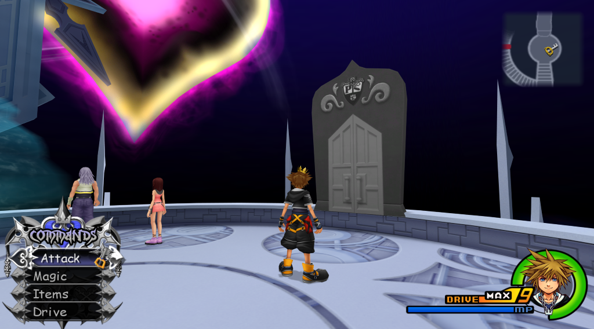

### Data Xigbar

Location: Land of Dragons - Summit\
Instructions (GoA ROM): Enter the door that appears here once Storm Rider is defeated\
Instructions (Other): Simply entering the room once Storm Rider is defeated should give access to the path to Data
Xigbar

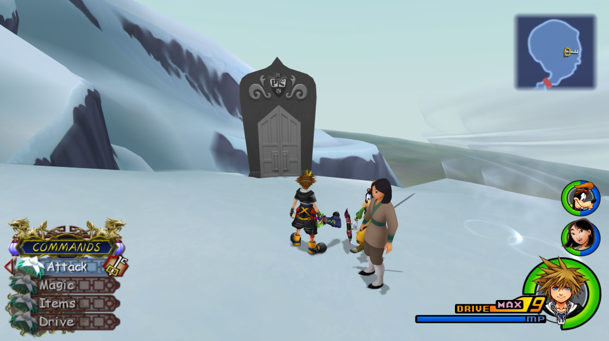

### Data Xaldin

Location: Beast's Castle - Ballroom\
Instructions (GoA ROM): Enter the door that appears here once "normal" Xaldin is defeated\
Instructions (Other): Simply entering the room once "normal" Xaldin is defeated should give access to the path to Data
Xaldin

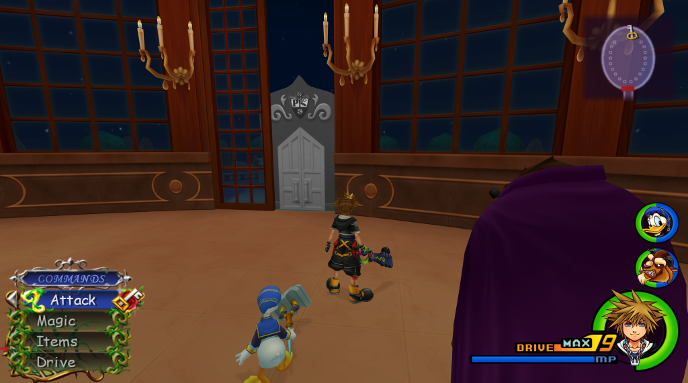

### AS Vexen / Data Vexen

Location: Halloween Town - Yuletide Hill\
Instructions: Interact with the orb to access the fights. Once the Absent Silhouette version is defeated, subsequent
fights will be against Data Vexen.

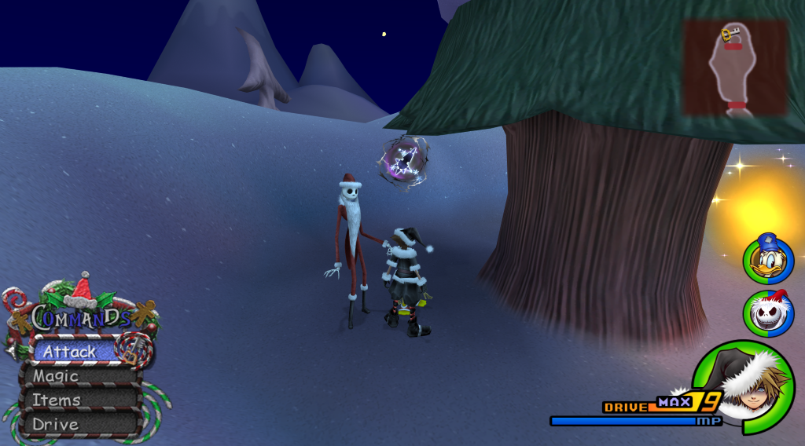

### AS Lexaeus / Data Lexaeus

Location: Agrabah - The Peddler's Shop\
Instructions: Interact with the orb to access the fights. Once the Absent Silhouette version is defeated, subsequent
fights will be against Data Lexaeus.

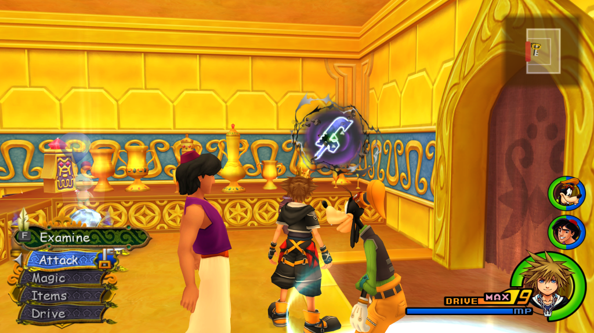

### AS Zexion / Data Zexion

Location: Olympus Coliseum - Cave of the Dead Inner Chamber\
Instructions: Interact with the orb to access the fights. Once the Absent Silhouette version is defeated, subsequent
fights will be against Data Zexion.

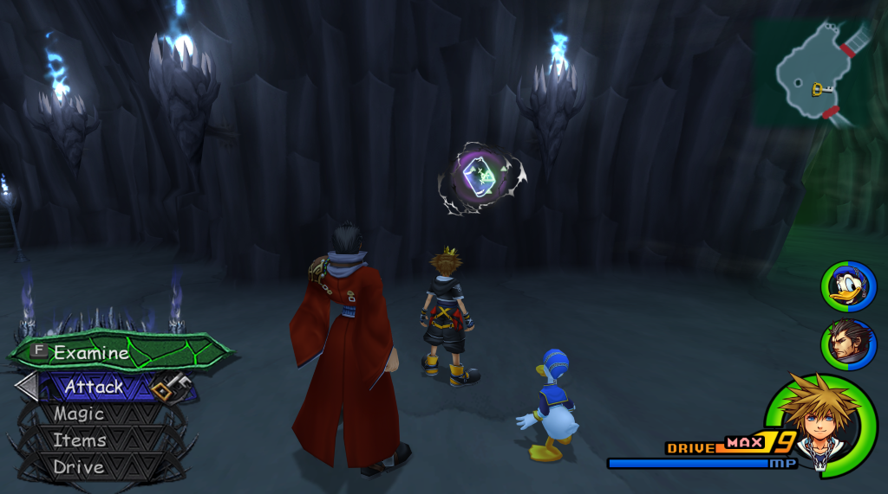

### Data Saix

Location: Pride Lands - Peak\
Instructions (GoA ROM): Enter the door that appears here once Groundshaker is defeated\
Instructions (Other): Simply entering the room once Groundshaker is defeated should give access to the path to Data Saix

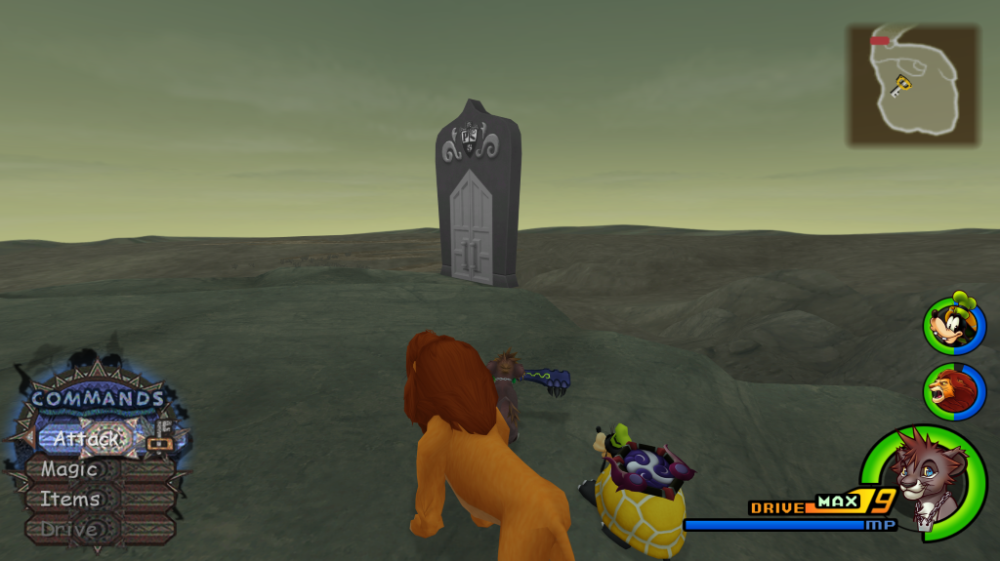

### Data Axel

Location: Twilight Town - Betwixt and Between\
Instructions (GoA ROM): Enter the door that appears once the normal fights in the room are complete\
Instructions (Other): Simply entering the room once the normal fights are complete should give access to the path to
Data Axel

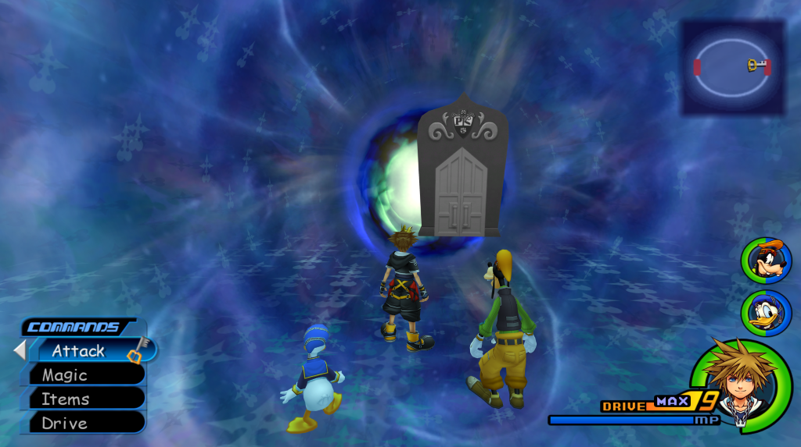

### Data Demyx

Location: Radiant Garden - Restoration Site\
Instructions (GoA ROM): Enter the door that appears at the exit of the Garden of Assemblage once the 1,000 Heartless
fight is complete\
Instructions (Other): Simply entering via the exit of the Garden of Assemblage once the 1,000 Heartless fight is
complete should give access to the path to Data Demyx

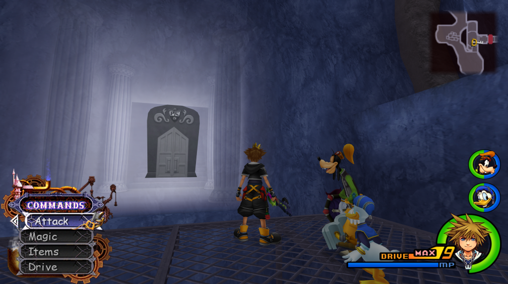

### Data Luxord

Location: Port Royal - Isla de Muerta Treasure Heap\
Instructions (GoA ROM): Enter the door that appears here once Grim Reaper 2 is defeated\
Instructions (Other): Simply entering the room once Grim Reaper 2 is defeated should give access to the path to Data
Luxord

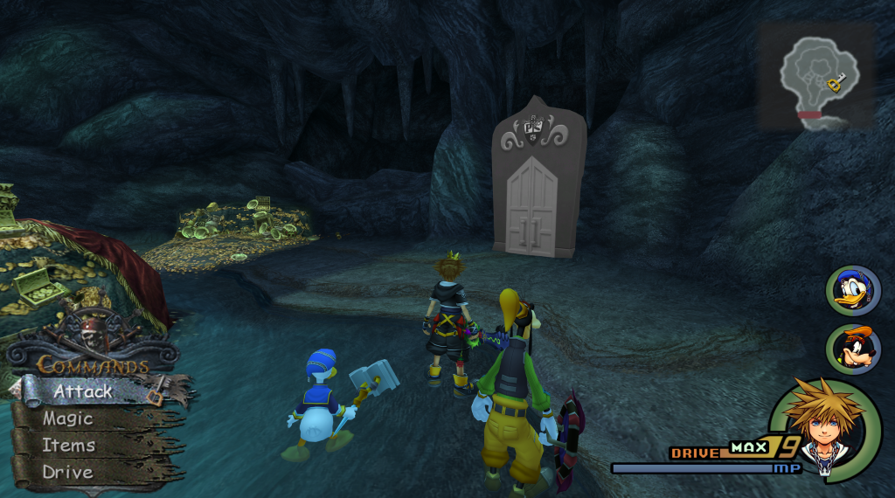

### AS Marluxia / Data Marluxia

Location: Disney Castle - The Hall of the Cornerstone\
Instructions: Interact with the orb to access the fights. Once the Absent Silhouette version is defeated, subsequent
fights will be against Data Marluxia.

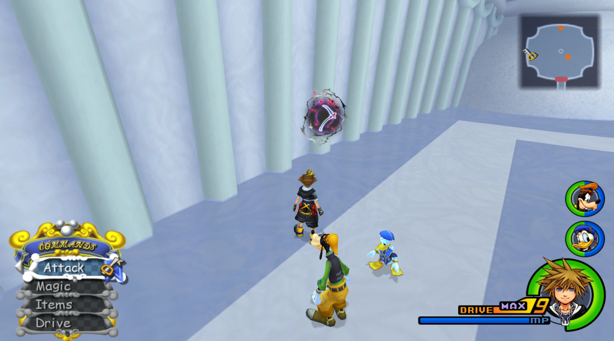

### AS Larxene / Data Larxene

Location: Space Paranoids - Central Computer Core\
Instructions (GoA ROM): Interact with the orb to access the fights. Once the Absent Silhouette version is defeated,
subsequent fights will be against Data Larxene.\
Instructions (Other): Interact with the computer's Light Cycle option to access the fights. Once the Absent Silhouette
version is defeated, subsequent fights will be against Data Larxene.

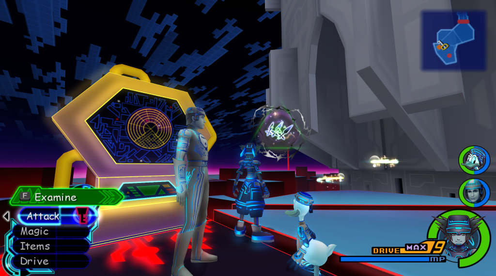

### Data Roxas

Location: Simulated Twilight Town - Mansion Pod Room\
Instructions (GoA ROM): Enter the door that appears here once the world's story is complete Instructions (Other): Simply
entering the room once the world's story is complete should give access to the path to Data Roxas

### Lingering Will (Terra)

Location: Disney Castle - The Hall of the Cornerstone\
Instructions: The fight is unlocked once the Proof of Connection is acquired and once Disney Castle / Timeless River's
story is complete. Interact with the swirling vortex to access the fight.

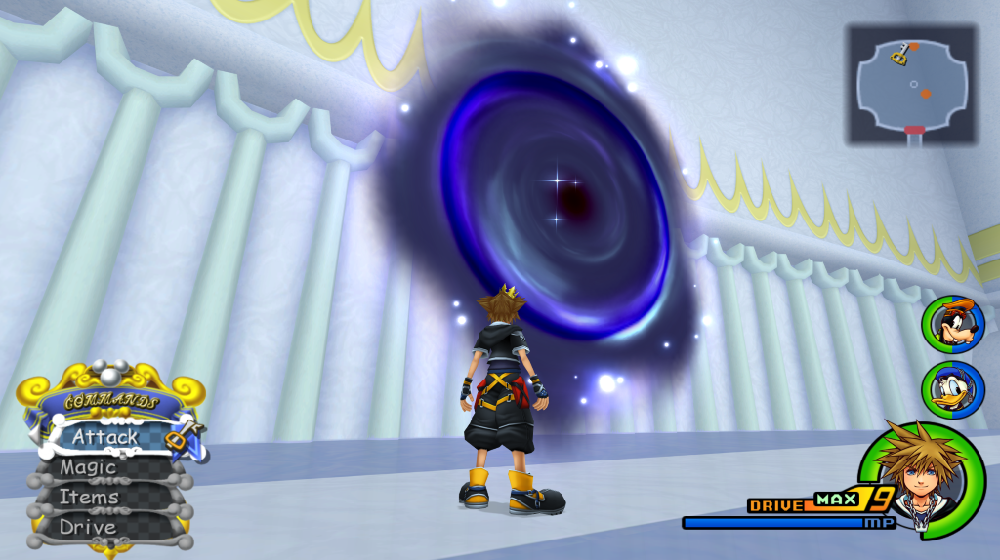
