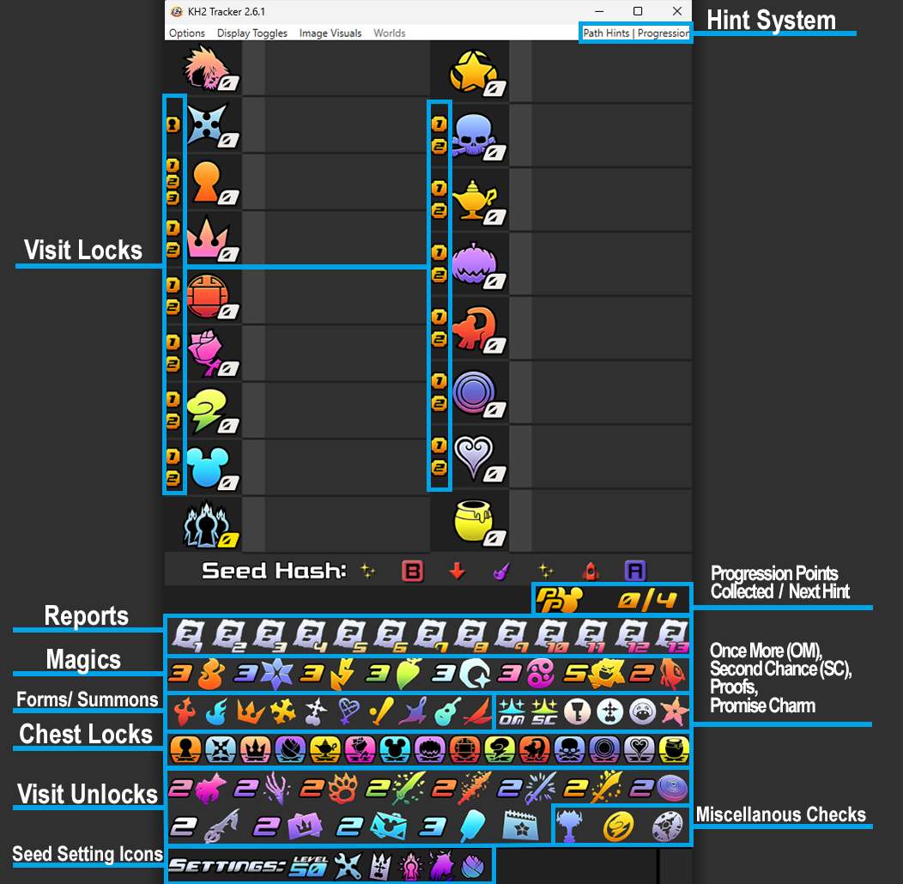
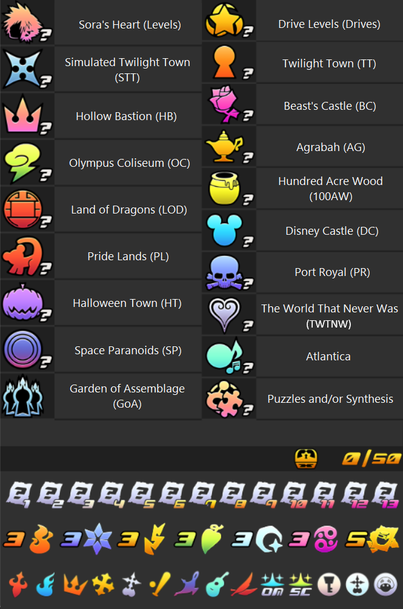
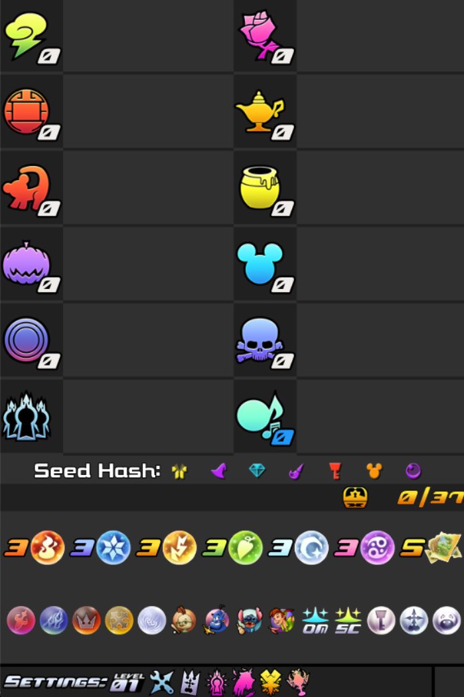

The randomizer community has the primary tracker as well as some novelty ones for other game modes.

* [KhTracker](#KHTracker)
* [Battleship Tracker](#Battleship)

## KHTracker

When playing the randomizer, it can be helpful to see everything you collect, what worlds you found the checks in, and your in-game stats. 

1. World Labels

The tracker displays all of the worlds that you may encounter while playing the randomizer. The image below showcases all of the locations where checks may potentially be found and their commonplace shorthand. The shorthand is included because many times streamers may say "I'm going to OC" instead of "I'm going to Olympus Coliseum."

Now that all of the locations are known, it is important to know you will not always encounter a location when playing a seed. For example, Atlantica and Puzzles & Synthesis are rarely included in any seed. In the randomizer generator, one can remove any worlds from the check pool, meaning that those worlds would not contain any important checks. The tracker will have access to this information when you load a seed in and remove those worlds from the tracker layout. So, for example, the image below showcases what the tracker looks like when I only want Disney worlds in the pool.

2. Check Labels

Note that while all the possible important checks are included in the image above, not all of them show up in various settings. For example, anti-form, munny pouches, Olympus Stone, Hades Cup, Unknown Disk, and Promise Charm are frequently omitted from seed settings. Additionally, the visit unlocks are not always turned on for certain settings. When turned on, you must find the world specific party member weapon to progress onwards to the second visit of each world. For example, to progress further than the Hydra fight in Olympus Coliseum, you must find Auron's weapon - Battlefields of War - to contine onwards. When these visit unlocking items are off, you are free to go wherever you please and those checks will disappear from the tracker. 

3. Numbers Meaning

4. Changing Image Styles

The tracker comes decked out with many styling features. These features do not change how the tracker functions at all, but does change the layout and visuals.

5. Instructions

## Novelty Tracker

The randomizer community has found several new ways to enjoy the randomizer that calls for a new
2. Battleship
3. Boss Enemy
4. Instructions
