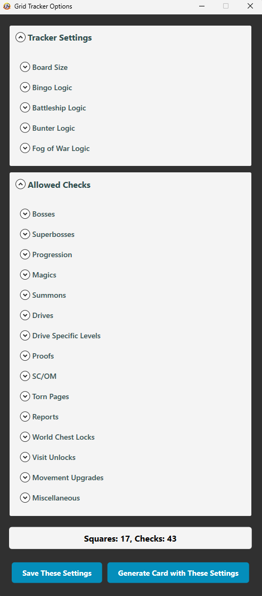
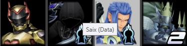
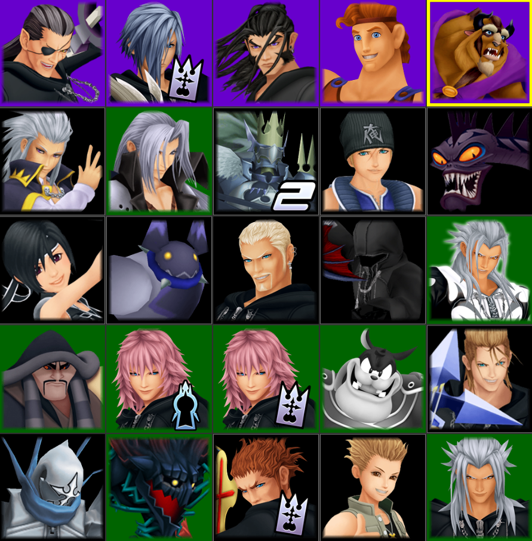
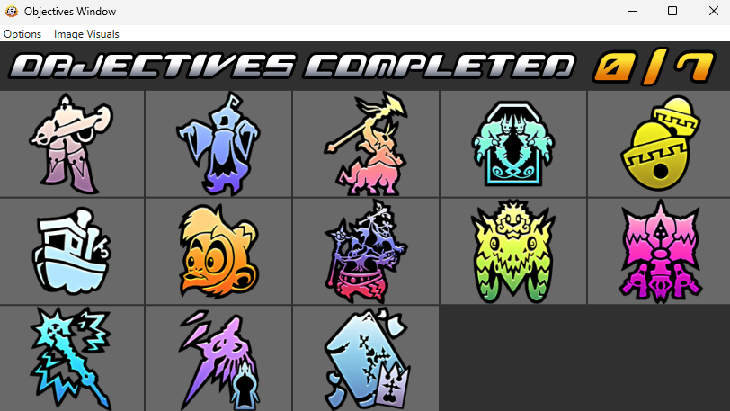

The randomizer community has the primary tracker as well as some novelty ones for other game modes.

* [KhTracker](#KHTracker)
    * [Instructions](#Instructions)
    * [Auto-Saving](#Auto-Saving)
    * [Saving + Loading Seeds](#Saving-and-Loading-Seeds)
* [Grid Tracker](#Grid-Tracker)
    * [Getting Started](#General-Information)
    * [Options](#Options)
    * [Game Modes](#Game-Modes)
* [Objectives Tracker](#Objective-Tracker)

# KHTracker

When playing the randomizer, it can be helpful to see everything you collect, what worlds you found the checks in, and your in-game stats. Everything that the tracker can display is annotated in the image below and will be referenced throughout the remainder of this page. If you want a complete summary of all the possible check locations in game, please refer to [Xtreone's summary](https://docs.google.com/spreadsheets/u/1/d/1XMUNvlLNSHX8f38_rm__eWByZA3whqh0tgHBGHWNfb8/edit#gid=1519464140).

   

<u>Note</u>: The exact layout and check inclusions are subject to change from version to version.

### World Labels

The tracker displays all of the worlds that you may encounter while playing the randomizer. The image below showcases all of the locations where checks may potentially be found and their commonplace shorthand. The shorthand is included because many times streamers may say "I'm going to OC" instead of "I'm going to Olympus Coliseum."

   

Now that all of the locations are known, it is important to know you will not always encounter a location when playing a seed. For example, Atlantica and Puzzles & Synthesis are rarely included in any seed. In the randomizer generator, one can remove any worlds from the check pool, meaning that those worlds would not contain any important checks. The tracker will have access to this information when you load a seed in and remove those worlds from the tracker layout. So, for example, the image below showcases what the tracker looks like when I only want Disney worlds in the pool.

   

### Check Labels

The section of the tracker beneath the worlds where all the checks are located are called _important checks_. These are checks that will track on the tracker to the appropriate world once you collect it in game.

Note that while all the possible important checks are included in the image above, not all of them show up in various settings. For example, anti-form, munny pouches, Olympus Stone, Hades Cup, Unknown Disk, and Promise Charm are frequently omitted from seed settings. Additionally, the visit unlocks are not always turned on for certain settings. When turned on, you must find the world specific party member weapon to progress onwards to the second visit of each world. For example, to progress further than the Hydra fight in Olympus Coliseum, you must find Auron's weapon - Battlefields of War - to continue onwards. When these visit unlocking items are off, you are free to go wherever you please and those checks will disappear from the tracker. 

### Changing Image Styles

The tracker comes decked out with many styling features. These features do not change how the tracker functions at all, but does change the layout and visuals. Under "Image Visuals" you can change the world, progression, and check icon visuals to your liking.

## Instructions

The tracker can be downloaded from [here](https://github.com/Dee-Ayy/KH2Tracker/releases) if you do not have it already. Scroll to the version you want to download and download the ".exe" file only. In the event your computer tries to protect you from the file, select "More Info" and then "Run anyway."

To use the KH2 Tracker, open the tracker by clicking on the KhTracker ".exe" file. Once the tracker loads, go to "Options > Hint Loading..." and select the appropriate hints extension (most likely Kh2 Randomizer Seed). Select the appropriate file once the file explorer window opens (most likely the randoseed zip you just generated). Once the seed is loaded in, launch KH2. It's good practice to confirm that the seed hash displayed in the start game menu matches the seed hash displayed on the tracker once the seed is loaded in. After this, go to "Options" > "Start Auto-Tracking". Make sure the tracker confirms that the autotracking has started. You will be able to tell because either the PCSX2 or PC icon (in green) will show up. Now you're good to start a seed!

## Auto-Saving

Occassionaly, the tracker could crash or get accidentally closed. You can have your tracker create auto-saves in the event that this happens. To do so, ensure that "Auto-Save Tracker Progress on Tracker Exit" and "Auto-Save Tracker Progress on Connection Loss" are toggled ON in the Options menu.

To load one of these autosaves, go to Options -> Load Tracker Progress and navigate to your KhTrackerAutoSaves directory which should be located in the same folder as your KH2Tracker. Select the most recently saved .tsv file, and your tracker should populate with the autosave information.

### Saving and Loading Seeds

In the event you want to save your randomizer progress to continue it at a later time, go to "Options" > "Save Current Progress" and save the resulting ".txt" file in a location you'll remember. Later on, to load it back into the tracker, go to "Options" > "Load Tracker Progress." If you have not done a new randomizer seed since saving, you can use the autosave mod to load back into your seed. Otherwise, make sure to make a hard save in KH2 before closing out your randomizer.

# Grid Tracker

### General Information

The grid tracker is a tracker that lays out several trackable items and progression events in a grid. The checks and events will be autotracked once they are collected and completed, respectively. To access it, go to Options -> Grid Tracker.

The grid uses card settings to generate new random grids. To customize the card settings to include certain checks, open the grid options window by going to Options -> Grid Settings in the Grid Tracker. This should pull up a window like the one showcased below, giving you a ton of ways to customize what can populate the grid.

   

To save these settings, select "Save These Settings" in the bottom left of the grid tracker options window. To generate a new card with the new settings select "Generate Card with These Settings" in the bottom right of the grid tracker options window.

Once you have the card settings you are satisfied with, load the seed into the tracker. **Note**: The rando seed changes the grid layout upon loading it into the tracker, so ensure that your tracker settings are set **before** loading in the randoseed.

You can switch between the simple and game icon styles in the grid tracker to make the icons more recognizable to you in the Image Visuals menu. Additionally, while the generator comes with a color label for every type of marked cell, you can change away from the default colors in the Options -> Color Settings menu.

With the exception of settings where a cell is purposefully hidden, hovering over a cell on the grid will reveal a description of what the check represents (example shown below). 

   

### Options

The grid tracker allows for a lot of customizability. Here we outline the grid tracker settings.

1. **Board Size:**

These settings customize the number of rows and cells to include in the grid. Note that these values will adjust if the number of squares on the grid exceeds the number of allowed checks.

2. **Bingo Logic:**

Turning Bingo Logic ON will record when rows, columns, or diagonals are completed.

   

3. **Battleship Logic:**

Including battleship logic will attempt to place a specified number of ships specified in the options. If Random Ship Count is OFF, then each comma separated value represents a ship size to place on the grid. If Random Ship Count is ON, then a random number of ships will be selected and can have a random size included in the comma separated values. Some examples are displayed below:

| Ship Sizes     | Random Ship Count | Outcome                                                                                                    |
|----------------|-------------------|------------------------------------------------------------------------------------------------------------|
| 2,3,4,5        |        OFF        | 4 ships, one of each size.                                                                                 |
| 2,3,4,5        |        ON         | Random number of ships, each ship being equally likely to be 2, 3, 4, or 5 in size.                        |
| 2,3,3,3,4,5    |        OFF        | 6 ships, one of each size, except for ships of size 3, of which there are three.                           |
| 2,3,3,3,4,5    |        ON         | Random number of ships, with ships of size 3 being 3 times more likely to be selected than any other size. |

4. **Bunter Logic:**

This setting only applies when boss randomization is turned on.

Including bunter (short for boss hunter) logic removes certain "duplicate" bosses from the card. In the bunter format, the story/AS vs. Data version of the organization members as well as the 2 Pete fights are considered the same boss. If bunter logic is OFF, then both the AS or a Data are fair game for the card.

For example, suppose AS Marluxia replaces AS Vexen and Data Marluxia replaces Data Vexen. If bunter logic is ON, only AS Marluxia will be a valid icon on the card. If bunter logic is OFF, then both versions of Marluxia are fair game.

5. **Fog of War Logic:**

Toggling this setting on will hide all the checks at the start of a seed. If ON, the number of neighboring cells that get revealed can be customized. 

## Game Modes

Below are examples common game mode supported by the grid tracker, but this list is not exhaustive and the grid tracker is versatile enough 
to support your own custom win conditions!

### Example: Battleships

Just like the classic board game, the grid tracker can place battleships for you to find and sink! The goal is to sink all of the ships.

The tracker will inform you when you have sunk all ships. This feature is especailly useful if you are playing with a random number of ships, as the "Sunk All Ships" confirms you have sunk ALL the ships and there are no additional undiscovered ships still floating around. [Here](static/standard_battleships.json) is a starter battleship card setting!

You can further customize battleships by changing the grid-allowed checks, the grid size, the number of ships, the ship sizes, randomizing the number of ships, etc.

### Example: Bingo

As the name implies, bingo arranges any assortment of checks you want onto the grid and if "Bingo Logic" is ticked on in the grid options window, the grid will actually highlight your bingos as you complete them. [Here](static/CJ_IC_Bingo.json) is an initial card setting inspired by CJ_2123's important check bingo!

You can further customize bingo by changing the grid size, allowed checks, etc. 

### Example: Boss + Enemy Randomized Bingo (aka Bunter)

A common format utilizing the grid tracker is Boss + Enemy Randomized Bingo where the objective is to get 3 bingos on a grid of 5x5 bosses, all of them shuffled into randomized arenas. If a seed with randomized bosses is loaded into the tracker, the tracker knows to track the newly randomized boss. [Here](static/bunter.json) is the card setting to play Zeddikus' bunter format!

# Objective Tracker

When the win condition is based on objectives (instead of proofs or emblems), the objective tracker conveniently lists all of the objectives available and autotracks them upon completion. To access it, go to Options -> Objectives Tracker.

The objective window will also display how many of the available objectives must be completed to open the door to final fights as well as how many objectives you have currently completed. For example, in the image below, there are 13 available objectives, and 7 are required to open the door to final fights. As checks get collected, the checks count up from 0.

  

If you are specifically playing the 1 Hour Challenge, ensure to toggle on the "Enable 1Hour Mode Changes" to see the 1 Hour specific objectives with their associated point values. 

