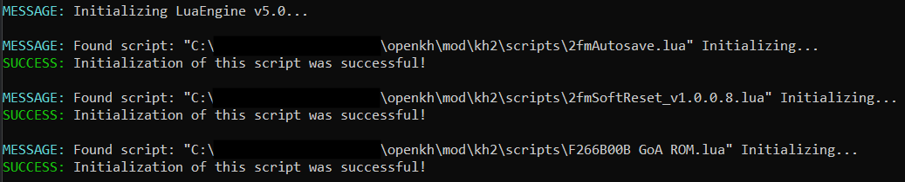

# Troubleshooting

* [Setup Issues](#setup-issues)
* [In-Game Issues](#in-game-issues)
* [Troubleshooting GoA (PC)](#troubleshooting-goa-pc)
* [Troubleshooting GoA (PCSX2)](#troubleshooting-goa-pcsx2)

## Setup Issues

### Why won't OpenKH Mods Manager start up?

* You may be missing the .NET Desktop Runtime. See [Downloads](../downloads/index.md).
* Depending on your system setup, you may need to run the Mods Manager program with Administrator privileges

## In-Game Issues

### Why does the game load into the Wedding Ship?

This usually means the Garden of Assemblage Lua script did not load properly.
See [Troubleshooting GoA (PC)](#troubleshooting-goa-pc) or [Troubleshooting GoA (PCSX2)](#troubleshooting-goa-pcsx2).

### (PC) Why does the game crash immediately upon startup?

* You may be using an incorrect version of LuaBackend Hook. See [Troubleshooting GoA (PC)](#troubleshooting-goa-pc).
* You may be running an incorrect version of the game. Randomizer only supports an up-to-date, legitimately purchased
  copy of the game from Steam or the Epic Games Store.

### (PC) Why does the game crash when interacting with the Moogle in the Garden of Assemblage?

This usually means the Garden of Assemblage Lua script did not load properly.
See [Troubleshooting GoA (PC)](#troubleshooting-goa-pc).

### (PC) Why does the game crash when interacting with the map in Port Royal?

This is a common crash known as ["map crash"](../glossary/index.md#map-crash).

### (PC) Why does the game crash after defeating The Experiment in Halloween Town?

This is a crash caused by using the finisher of the Dance Call limit to end the fight. Avoid using the finisher at the
end of the fight to avoid this crash.

### Why does my game start in Twilight Town as Roxas, rather than at the Station of Awakening as Sora?

This usually means the Garden of Assemblage mod did not load properly.
See [Troubleshooting GoA (PC)](#troubleshooting-goa-pc) or [Troubleshooting GoA (PCSX2)](#troubleshooting-goa-pcsx2).

### (PCSX2) Why is my game in Japanese?

* Make sure you're opening PCSX2 via the "Build and Run" command in OpenKH Mods Manager and not opening PCSX2 directly
* Make sure the order of your mods in OpenKH Mods Manager is correct. See
  [Troubleshooting GoA (PCSX2)](#troubleshooting-goa-pcsx2).

## Troubleshooting GoA (PC)

Press the F2 key while the game is open. A window should appear giving information about loaded Lua scripts. It should
look similar (but not identical) to this screenshot:

If that window does not appear, it's likely the LuaBackend Hook is missing, is in the wrong location, or is an incorrect
version. If you already have LuaBackend Hook installed, it may need to be reconfigured or may need to be completely
removed and reinstalled.
* See the [PC Setup Guide](../setup/Panacea-ModLoader/index.md#setting-up-openkh-mods-manager) for additional
  instructions

If the Lua scripts window _does_ appear, and you're still having trouble, verify that you have only one Garden of
Assemblage Lua script. It's fine to have other Lua scripts such as soft reset, auto-save, etc., but only one GoA script
should be active at any given time.

## Troubleshooting GoA (PCSX2)

Consult the [PCSX2 Setup Guide](../setup/pcsx2-ex-setup/pcsx2-ex-setup.md) and verify you've set everything up
as described.
