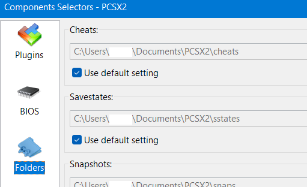

# Troubleshooting

* [Setup Issues](#setup-issues)
* [In-Game Issues](#in-game-issues)

## Setup Issues

### Why won't OpenKH Mods Manager start up?

* You may be missing the .NET Desktop Runtime. See [Downloads](../downloads/index.md).
* Depending on your system setup, you may need to run the program with Administrator privileges

## In-Game Issues

### (PC) Why does the game crash immediately upon startup?

* You may be using an incorrect version of LuaBackend Hook (the `DBGHELP.dll` file).
  See [Downloads](../downloads/index.md) for a link to the latest version.
* You may be running an incorrect version of the game. Randomizer only supports a legitimately purchased copy of the
  game from Epic Games Store.

### Why does my game start in Twilight Town as Roxas, rather than at the Station of Awakening as Sora?

This usually means the Garden of Assemblage mod did not load correctly.

#### PC

Press the F2 key while the game is open. A window should appear giving information about Lua scripts. If that window
does not appear, it's likely one of two causes.

* Verify that you have the `DBGHELP.dll` placed in the game install directory (usually something
  like `C:\Program Files\Epic Games\KH_1.5_2.5`)
* Verify that you have the Garden of Assemblage `.lua` script in the correct scripts folder (usually something
  like `C:\Users\johndoe\Documents\KINGDOM HEARTS HD 1.5+2.5 ReMIX\scripts\kh2`)

#### PCSX2

* Verify that you have "Enable Cheats" checked in the PCSX2 System menu

* Verify that you have the Garden of Assemblage `.pnach` file in the correct cheats folder
    * The correct folder can be found on the "Plugin/BIOS Selector" screen from the PCSX2 Config menu

* Verify that the Garden of Assemblage `.pnach` file name starts with `F266B00B` - this is how PCSX2 knows to link that
  file up with the version of KH2 that we use for randomizer

### (PCSX2) Why is my game in Japanese?

* Make sure you're opening PCSX2 via the "Build and Run" command in OpenKH Mods Manager and not opening PCSX2 directly
* Make sure the order of your mods in OpenKH Mods Manager is correct. The correct order (top to bottom) is
    * Randomizer seed
    * All-in-One
    * Language Pack

### Why are my keyblades not randomized? Why are certain Bonus Levels always the same?

The seed mod needs to be placed at the highest priority in OpenKH Mods Manager. Failure to do so will cause certain
defaults not to get overwritten.
